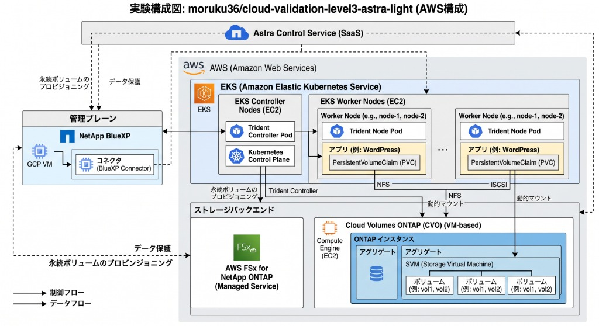

# クラウドアーキテクチャ検証 LEVEL3（Phase A → B → C 総合検証）

  <b>曖昧なビジネス要件・制約から自律型AIが実践的クラウド構成を設計・評価・実機検証するLEVEL3検証</b>

  <a href="experiments/A/final-report.md"><b>🅰️ Phase A結果</b></a> │
  <a href="experiments/B/README.md"><b>🅱️ Phase B結果</b></a> │
  <a href="experiments/C/README.md"><b>🅲 Phase C検証（現在）</b></a> │
  <a href="experiments/B/B-3/c-validation-plan.md"><b>📝 C計画書</b></a> │
  <a href="handoff.md"><b>📌 最新引継ぎ（handoff）</b></a>

---

## 1. 検証フェーズ（A → B → C）エグゼクティブサマリー

本リポジトリは、**Phase A（単一クラウド設計）**、**Phase B（3社比較・選定設計・評価）** を経て、現在 **Phase C（承認ゲート・IaC・実機／カオス検証・変更シナリオ対応）** の段階に入りました。

> [!NOTE]
> **プライベートアプリケーション要件およびURL非公開ポリシー**
> 本検証対象のWebシステムは機密性の高いプライベートなシステムを想定しています。そのため、**アプリケーション自体の実機URL、ホスト名、エンドポイントURLは一切リポジトリ内に記載せず、非公開**として管理・検証を進めています。

| フェーズ | 検証テーマ | 主要成果・ステータス | 評価・自己採点 | 判定・開発者にとっての意味 |
|---|---|---|:---:|---|
| **Phase A** | **AWS単一設計・リカバリ** | 要件定義（24要件）策定、Fargate+RDS設計、外形監視・運用設計 | 61点 → 65点 (不合格) | 外形監視費計上漏れで予算10万円超過判明。Bへの課題抽出完了 |
| **Phase B** | **3社比較・選定・評価** | AWS/GCP/Azure同一条件比較、AWS優先参考設計化、B-3評価・C計画策定 | 66点 / 100点 (不合格) | 最安既知基本費でAWSを優先参考設計とするも、必須要件根拠不足で合格基準（80点）未達 |
| **Phase C** | **実機検証・障害・変更対応** | **【現在フェーズ】** 承認ゲート、IaC、実機負荷、カオスDB障害、論理復元、4変更シナリオ | C-0承認待ち → C-1〜C-10順次実施 | 設計合格・人間採用承認の前提となる実証データを取得・合否判定 |

> [!IMPORTANT]
> **「文書工程の完了」と「設計合格・実機採用」の分離**
> Phase A（65点）、Phase B（66点）の設計自己採点はいずれも合格基準（80点）未達のままです。Phase C では、残された技術的論点（無人自動復旧、片AZ性能、論理破損復元、4つの変更シナリオ耐性）を実機試験（C-1〜C-10）によって検証・証明し、設計の成立可否を判定します。

---

## 2. 対象アプリケーションの現状と前提仕様

本検証で設計・実機検証対象としているアプリケーションの現在の構成・仕様ステータス：

| 項目 | アプリケーション現状・前提仕様 | プライベート保護・検証上の留意点 |
|---|---|---|
| **アプリケーション種別** | 新規国内B2C向けWebシステム（会員管理・画像配信・通知） | プライベートシステム。**公開URL・実エンドポイントは完全非公開** |
| **主要機能** | 会員登録、ログイン認証、プロフィール編集、商品・コンテンツ閲覧、お気に入り、管理者コンテンツ更新 | 決済・動画・リアルタイムチャット・重分析は対象外。更新は次回本人参照へ即時反映 |
| **データ特性** | 氏名・メール・認証情報・プロフィール・お気に入り（初期20GB＋2GB/月） | 個人情報を含むため**日本国内リージョン完結保管**。退会後30日削除・バックアップ35日保持 |
| **負荷特性** | 通常10 RPS、ピーク100 RPS（15分間、読書比率9:1）、同時接続500人 | 将来的に1000 RPS（10倍）および登録100万人規模へのスケールを想定 |
| **SLO / 可用性** | 暦月99.9%以上（外部E2E計測）。単一障害からのRTO 30分・RPO 5分 | 平日専任1名（夜間即応なし）のため、2AZ自動フェイルオーバー・夜間無人復旧が必須 |
| **月額予算上限** | 税込100,000円 / 月（本番環境＋最小開発検証環境） | 無料枠・長期割引・クレジット非依存。人件費・ドメイン取得費は除外 |

---

## 3. 全体検証フローとリポジトリ構造

`mermaid
flowchart TD
    Req["要件定義・共通方針 (docs/)"] --> ExpA["Phase A: AWS単一設計・リカバリ (experiments/A/)"]
    ExpA --> ExpB["Phase B: 3社比較・選定設計・評価 (experiments/B/)"]
    ExpB --> ExpC["Phase C: IaC・実機カオス試験・変更対応 (experiments/C/)"]
    ExpA --> Eval["評価・採点・引継ぎ (evaluation/ & handoff.md)"]
    ExpB --> Eval
    ExpC --> Eval
`

`mermaid
flowchart TB
  subgraph PhaseA ["Phase A: AWS単一設計（完了）"]
    direction LR
    A1["<b>A-1 要件定義</b> 24要件定義"] --> A2["<b>A-2 AWS設計</b> ECS+RDS Multi-AZ"] --> A3["<b>A-3 設計評価</b> 61→65点 (予算超過)"]
  end

  subgraph PhaseB ["Phase B: 3社比較・選定・評価（完了）"]
    direction LR
    B1["<b>B-1 3社比較</b> AWS/GCP/Azure比較"] --> B2["<b>B-2 選定・設計</b> AWS優先参考/条件統一"] --> B3["<b>B-3 評価・引継ぎ</b> 66点不合格・C計画作成"]
  end

  subgraph PhaseC ["Phase C: 検証・障害試験（進行中フェーズ）"]
    direction LR
    C0["<b>C-0 承認・前提確定</b> 予算・期限・許可"] --> C1["<b>C-1〜C-6 実機・カオス</b> 無人復旧/論理復元/片AZ"] --> C2["<b>C-7〜C-10 変更対応・終了</b> 1000RPS/2倍/Private/Cleanup"]
  end

  PhaseA -->|課題引継ぎ| PhaseB
  PhaseB -->|C計画引継ぎ| PhaseC

  classDef done fill:#14532d,stroke:#22c55e,stroke-width:2px,color:#ffffff;
  classDef failed fill:#7f1d1d,stroke:#ef4444,stroke-width:2px,color:#ffffff;
  classDef current fill:#1d4ed8,stroke:#3b82f6,stroke-width:2px,color:#ffffff;
  class A1,A2,B1,B2 done;
  class A3,B3 failed;
  class C0,C1,C2 current;
`

### 全工程のステータス一覧

| フェーズ | 工程 | 状態 | 自己評価 | 主な結果と次の扱い | 関連成果物 |
|---|---|---|:---:|---|---|
| **Phase A** | **A-1〜A-3** | 完了 | 65 / 100 | AWS単一設計。外形監視費用の計上漏れ発覚により月額10万円超過で不合格。 | [A詳細レポート](experiments/A/final-report.md) |
| **Phase B** | **B-1** | 完了 | - | 3社（AWS/GCP/Azure）を同一負荷条件で比較。暫定順位: AWS > GCP > Azure。 | [B-1サマリー](experiments/B/B-1/README.md) |
| **Phase B** | **B-2** | 完了 | 66 / 100 | 7日PITR共通条件案でAWSを優先参考設計化。最終選定・採用承認は保留。 | [B-2設計](experiments/B/B-2/README.md) |
| **Phase B** | **B-3** | 完了 | **66 / 100** | 24要件追跡・配点別レビュー・限定修正・C計画作成。**設計不合格・C移行**。 | [B詳細レポート](experiments/B/final-report.md) |
| **Phase C** | **C-0〜C-10** | **進行中** | - | **承認ゲート確認・IaC構築・実機負荷・カオス障害・変更シナリオ検証**。 | [C概要](experiments/C/README.md) / [C検証計画](experiments/B/B-3/c-validation-plan.md) |

---

## 4. 3クラウド比較とコスト推移（B-1 → B-2/B-3）

3社共通条件（初期1万人、月間100万PV、通常10/peak 100 RPS、外向き200GB、国内保存、為替150円/USD、税10%）での月額費用推移：

| クラウド | B-1 税込基本月額 | B-2/B-3 税込基本月額 | 予算（10万円）判定 | 主な変動理由・採用状況 |
|---|---:|---:|:---:|---|
| **AWS** (優先参考) | **76,034 円** | **83,248 円 ＋ U** | **枠内**（余地 16,752円） | 非本番入口常設化、監視、DR資材追加。最安値だが未精算Uあり |
| **Google Cloud** | 135,580 円 | 101,933 円 ＋ U | 超過（1,933円オーバー） | Cloud SQL Enterprise化・東京LB補正により約3.3万円圧縮も予算超 |
| **Azure** | 216,493 円 | 218,588 円 ＋ U | 大幅超過（11.8万円オーバー） | コンテナ/DBのマネージド単価が高く、現行要件では予算大幅超過 |

> [!NOTE]
> **「＋ U」について**: 未精算費用（ログ流量、メトリクス数、データ転送の超過分、バックアップ保持量、追加セキュリティ設定等）を指します。AWSの残余16,752円はUの精算や要件強化によって容易に消費される可能性があります。

---

## 5. Phase B 評価結果と Phase C での実機検証項目

Phase B自己評価スコア（66点）において「3」にとどまった重点項目を、Phase Cの実機・カオス試験で検証します。

`mermaid
flowchart LR
  subgraph PhaseB_Issues ["Phase B 設計課題 (F01〜F11)"]
    F1["データ主権・保存境界 (SES受信側・Route53ログ)"]
    F2["退会削除・原期限保持 (S3複製先・PITR再削除)"]
    F3["夜間無人復旧・片AZ容量 (RTO30分/RPO5分/100RPS)"]
    F4["内製運用の実現性 (専任1名での保守負荷)"]
  end

  subgraph PhaseC_Tests ["Phase C 実機検証対応 (C-1〜C-10)"]
    T1["C-2: 認証・画像・SES送信境界検証"]
    T2["C-5: 論理破損復元 & 退会再削除台帳"]
    T3["C-3/C-4: 片AZ負荷 & 制御DBフェイルオーバー"]
    T4["C-10: ロールバック & 保守運用演習"]
  end

  F1 --> T1
  F2 --> T2
  F3 --> T3
  F4 --> T4
`

---

## 6. Phase C の検証ステップ（C-0 〜 C-10）と変更シナリオ

Phase C は以下のステップに沿って独立して実施されます。

`mermaid
flowchart TD
  C0["<b>C-0 承認ゲート・前提確定</b> 実験予算 (12,495円+U) / 保持期限 / 操作許可"] --> C1["<b>C-1 隔離環境再構築 (L)</b> IaC再現性・State分離"]
  C1 --> C2["<b>C-2 機能・セキュリティ (L)</b> 内製認証・画像制限・SES・Canary"]
  C2 --> C3["<b>C-3 負荷・片AZ容量 (H)</b> 通常10RPS / ピーク100RPS / 片AZ縮退"]
  C3 --> C4["<b>C-4 無人復旧・制御DB障害 (H)</b> タスク/DB障害・自動フェイルオーバー"]
  C4 --> C5["<b>C-5 論理破損・退会再削除 (H)</b> 20GB特定時点復元 (4h)・再削除"]
  C5 --> C6["<b>C-6 国内リージョン復元 (H)</b> 大阪DR・東京依存遮断コールド復旧"]

  subgraph ChangeScenarios ["必須4変更シナリオの検証"]
    C7["<b>C-7 シナリオ1: 1000 RPS</b> 10倍負荷・スケール限界検証"]
    C8["<b>C-8 シナリオ3: 月額2倍分析</b> 支出なし・感度分析・再選定条件"]
    C9["<b>C-9 シナリオ4: Public IP禁止</b> Private化・NAT/Endpoint検証"]
  end

  C6 --> C7
  C7 --> C8
  C8 --> C9
  C9 --> C10["<b>C-10 保守引継ぎ・最終Cleanup</b> ロールバック演習・全リソース完全削除"]
`

---

## 7. アーキテクチャ概要 (AWS優先参考設計)

専任1名の運用負荷を抑えつつ、同期整合性（SQL）と夜間の自動復旧を両立するため、**AWS Fargate (ARM) + Amazon RDS PostgreSQL (Multi-AZ)** をベースとしています。
※ プライベートなアプリケーション環境のため、外部公開エンドポイントURLや実機URLは一切掲載していません。

### システム構成図

  

#### 論理構成図 (Mermaid)

`mermaid
flowchart TB
  subgraph PublicLayer ["パブリックアクセス"]
    direction LR
    U["<b>利用者 / クライアント</b>"]
    DNS["<b>Route 53 (DNS)</b>"]
    U -. DNS解決 .-> DNS
  end

  subgraph IngressLayer ["エントリ & セキュリティ"]
    direction LR
    WAF["<b>AWS WAF (Regional)</b> Rate Limit / 入力攻撃防御"]
    ALB["<b>ALB (HTTPS終端)</b> 2AZ負荷分散"]
    WAF ==>|検査後転送| ALB
  end

  subgraph TokyoVPC ["AWS 東京リージョン (本番環境 / 2AZ冗長)"]
    direction TB
    subgraph ComputeTier ["アプリケーション層 (常時2タスク並行)"]
      direction LR
      AppA["<b>ECS Fargate (AZ-A)</b> 1vCPU / 2GB"]
      AppB["<b>ECS Fargate (AZ-B)</b> 1vCPU / 2GB"]
    end

    subgraph DatabaseTier ["データストア層 (同期Multi-AZ)"]
      direction LR
      DB_Pri[("<b>RDS PostgreSQL Primary</b> AZ-A (gp3 50GB)")]
      DB_Stb[("<b>RDS PostgreSQL Standby</b> AZ-B (同期待機)")]
      DB_Pri <-->|同期レプリケーション| DB_Stb
    end
  end

  subgraph ServicesTier ["マネージド共通基盤 & DR保管"]
    direction LR
    S3["<b>S3 バケット (東京)</b> 画像・内部バックアップ"]
    Auth["<b>アプリ内製認証</b> (Cognito代替でコスト削減)"]
    SES["<b>SES 東京</b> メール送信"]
    CW["<b>CloudWatch + Probe</b> 監視・軽量外形監視"]
    DR_S3[("<b>S3 大阪 (DR)</b> 日次DBダンプ / 画像複製")]
  end

  U ==>|HTTPS| WAF
  ALB -->|Private通信| AppA
  ALB -->|Private通信| AppB
  AppA -->|TLS| DB_Pri
  AppB -->|TLS| DB_Pri
  AppA --> S3
  AppB --> S3
  AppA --> Auth
  AppB --> Auth
  AppA --> SES
  AppB --> SES
  AppA --> CW
  AppB --> CW
  S3 -.->|非同期複製| DR_S3
  DB_Pri -.->|日次スナップショット| DR_S3
`

---

## 8. ドキュメントマップ（Phase A → B → C）

### 企画・要件・共通ルール (docs/)
- [要件定義・全体方針](docs/requirements.md) : ビジネス背景、24要件、制約条件の整理
- [実行ポリシー](docs/execution-policy.md) : AIエージェントの作業手順・禁止事項・評価方針
- [正式業務回答](docs/sources/business-answers-2026-09-08.md) : ヒアリングに対する顧客側の正式回答
- [ADR意思決定記録](docs/decisions/ADR-A2-001.md) : 初期アーキテクチャ選定理由

### Phase A: AWS単一クラウド検証 (xperiments/A/)
- [**★ LEVEL3-A 総合検証結果レポート**](experiments/A/final-report.md) : A-1〜A-3の全結果・採点・課題
- [A実行完了報告](experiments/A/completion-report.md) : A完了時の引継ぎ記録
- **A-1**: [24要件一覧](experiments/A/A-1/requirements.md) / [質疑応答台帳](experiments/A/A-1/questions.md) / [リスク・仮定](experiments/A/A-1/assumptions-risks.md)
- **A-2**: [AWS基本設計](experiments/A/A-2/design.md) / [構成図](experiments/A/A-2/diagram.md) / [復旧・運用](experiments/A/A-2/recovery-operations.md) / [初期費用](experiments/A/A-2/cost.md)
- **A-3**: [自己評価スコア (61→65点)](experiments/A/A-3/scores.md) / [改善仕様](experiments/A/A-3/revised-design.md) / [予算監査](experiments/A/A-3/budget.md) / [要件追跡](experiments/A/A-3/traceability.md)

### Phase B: 3クラウド比較・選定設計・総合評価 (xperiments/B/)
- [**★ LEVEL3-B 開発者向け結果サマリー**](experiments/B/README.md) : **B工程全体（B-1〜B-3）の要約と開発者向け解説**
- [**★ LEVEL3-B 詳細レポート**](experiments/B/final-report.md) : **比較・設計・評価の正式統合レポート**
- **B-1: 3クラウド比較フェーズ**
  - [B-1 サマリー](experiments/B/B-1/README.md) / [3社比較詳細](experiments/B/B-1/comparison.md) / [費用内訳](experiments/B/B-1/cost.md) / [比較基準](experiments/B/B-1/comparison-criteria.md) / [公式出典](experiments/B/B-1/sources.md)
- **B-2: 条件別設計フェーズ**
  - [B-2 サマリー](experiments/B/B-2/README.md) / [設計書](experiments/B/B-2/design.md) / [費用モデル](experiments/B/B-2/cost.md) / [選定理由・逆転条件](experiments/B/B-2/selection.md) / [復旧・可観測性](experiments/B/B-2/recovery-observability.md) / [実証対応計画](experiments/B/B-2/validation-plan.md)
- **B-3: 評価・引継ぎフェーズ**
  - [B-3 成果物トップ](experiments/B/B-3/README.md) / [配点別採点表 (66点)](experiments/B/B-3/scores.md) / [レビュー指摘 (F01〜F11)](experiments/B/B-3/review.md) / [限定修正](experiments/B/B-3/revised-design.md) / [24要件追跡](experiments/B/B-3/traceability.md) / [Phase C検証計画](experiments/B/B-3/c-validation-plan.md)

### Phase C: 実機検証・カオス試験・変更対応 (xperiments/C/)
- [**★ LEVEL3-C 検証計画・実施概要**](experiments/C/README.md) : **C工程の概要、フロー、変更シナリオ対応**
- [Phase C 検証計画書（詳細）](experiments/B/B-3/c-validation-plan.md) : C-0〜C-10のテスト定義と合否基準
- [C費用モデル定義 (JSON)](experiments/B/B-3/c-cost-model.json) : 小型構成(L)・本番相当構成(H)のコスト積算

### 評価プロセス・運用記録 (valuation/)
- [C 実行記録](evaluation/C-run.md)
- [B-3 実行記録](evaluation/B-3-run.md) / [B-2 実行記録](evaluation/B-2-run.md) / [B-1 実行記録](evaluation/B-1-run.md)
- [A-3 実行記録](evaluation/A-3-run.md) / [A-2 実行記録](evaluation/A-2-run.md) / [A-1 実行記録](evaluation/A-1-run.md)
- [人間の介入記録台帳](evaluation/human-intervention.md) : AIの自律性と介入記録
- [評価ルーブリック](evaluation/rubric.md) : 採点基準定義

### 引継ぎ・資産管理
- [**最新引継ぎ書 (handoff.md)**](handoff.md) : 現在の状態、保留事項、次工程の起点
- [資源台帳 (resource-inventory.md)](resource-inventory.md) : クラウド残存リソース0件・利用費0円の記録
