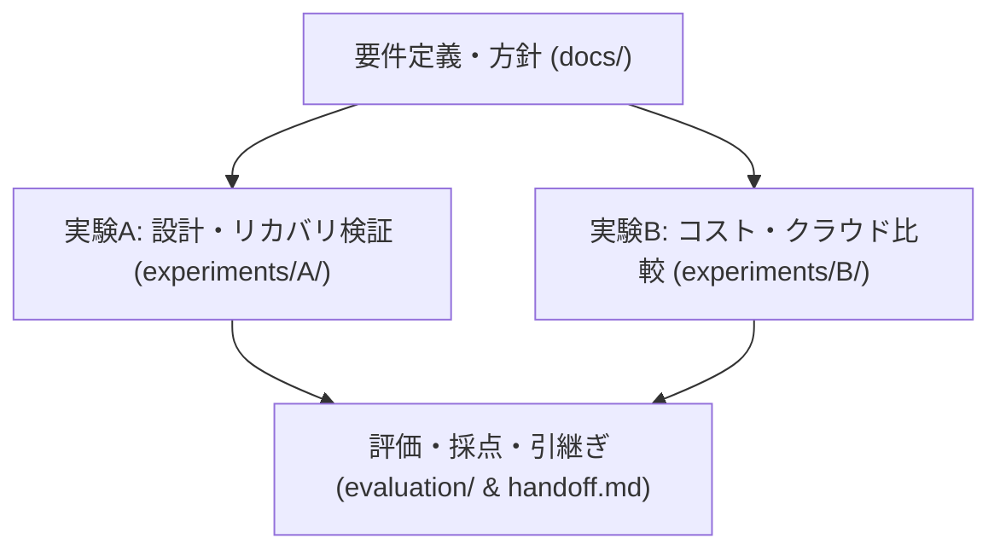
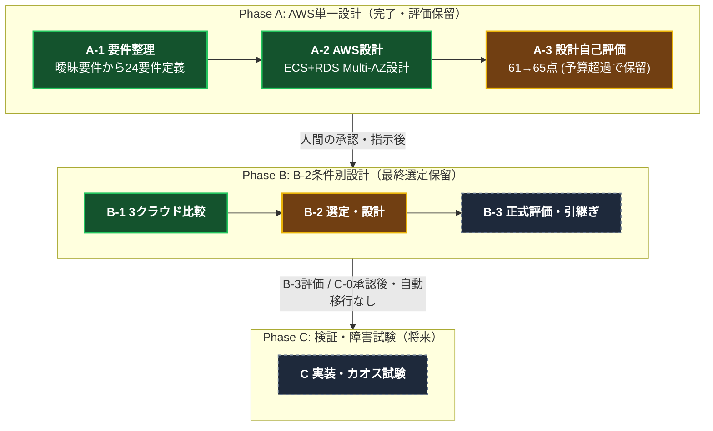
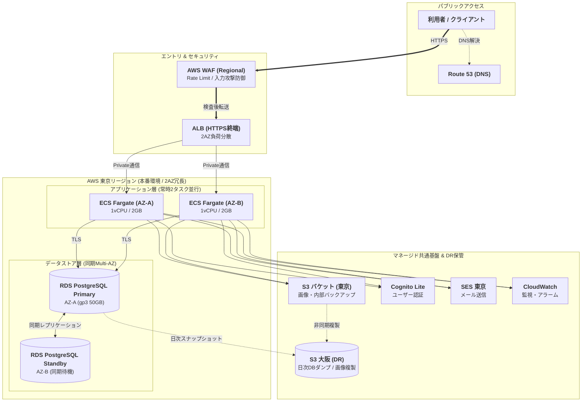

# クラウドアーキテクチャ検証 LEVEL3（B-3: 評価・引継ぎ）

**最新：[B詳細レポート](experiments/B/final-report.md)** ／ [B-3成果物](experiments/B/B-3/README.md) ／ [引継ぎ](handoff.md)

自己評価は初回/B-2完了/B-3限定修正後66/66/66点、設計不合格。AWS優先参考・最終選定/人間採用承認保留、C移行保留。次はB-2限定差戻しです。基本月額AWS83,248円＋未精算U。工程のGitHub反映は[run](evaluation/B-3-run.md)参照。

本リポジトリは、**曖昧なビジネス要件・制約からAI（自律型エージェント）が実践的かつ合理的なクラウド構成を設計・判断・評価できるかを検証するプロジェクト**（LEVEL3検証）の記録および成果物です。

クラウドエンジニアや開発チームが設計意図・検証結果・課題を直感的に把握できるよう整理しています。

---

## 1. プロジェクト概要

- **目的**: 曖昧なビジネス要件に対し、AIが適切な要件定義、アーキテクチャ選定、コスト見積、耐障害・運用設計を行えるかの検証
- **指定モデル**: GPT-6 Astra Light（実行モデル識別情報は未確認）
- **検証シナリオ**:
  - **Phase A (工程完了・設計不合格)**: AWS単一クラウドの設計と自己評価
  - **Phase B (B-3評価・選定保留)**: 3社比較/条件別設計を評価しB詳細レポートを作成。B-3 PRは未マージ[PR #12](https://github.com/moruku36/cloud-validation-level3-astra-light/pull/12)に依存、比較先b2/cloud-selection-design
  - **Phase C (将来フェーズ)**: IaC実装・実機デプロイ・カオスエンジニアリング（障害試験）

### 現在のステータス
- **進捗**: B-3で24要件/正式採点/限定訂正/C計画を作成。設計不合格・C移行保留。反映証跡・PR・次工程は[handoff](handoff.md)。以下のA/B-1結果は各工程の履歴です。
- **B-1結果**: 暫定順位AWS / GCP / Azure。全案に重要未確認、Azure代表案は予算未達。設計合格・最終採用ではない。[比較](experiments/B/B-1/comparison.md) / [費用](experiments/B/B-1/cost.md) / [追跡Issue #9](https://github.com/moruku36/cloud-validation-level3-astra-light/issues/9)
- **Aの設計自己評価スコア**: **65点 / 100点**（合格基準80点に未達、**採用承認保留**）
- **保留の主因**: 外形監視（CloudWatch Synthetics Canary）費用の精緻化に伴う**月額予算（税込10万円）の超過**（修正後: 約11.01万円〜予備費込約13.22万円）
- **クラウド実リソース**: 未作成（Phase Aはペーパー設計・評価のみ、クラウド利用費0円）

### リポジトリ構造と全体実験フロー

---

## 2. 業務・システム要件サマリ

以下の構成列と§3〜4はAの履歴。東京/大阪・SQL・台数・毎日ピーク・監視製品は業務必須ではない。B-1は[正式回答](docs/sources/business-answers-2026-09-08.md)を優先し、外向き200GBを総量として比較した。

| 項目 | 要件仕様 | 設計上のポイント・制約 |
|---|---|---|
| **サービス形態** | 新規国内B2C Webサービス | 会員登録、ログイン、一覧・詳細、お気に入り、管理機能 |
| **ユーザー規模** | 初期1万人 → 3年で100万人 | 月間100万PV、通常10 RPS、ピーク100 RPS（15分/日）、同時接続500人 |
| **目標SLA / 可用性** | 暦月 99.9% 以上 | 東京リージョン内 2つのAZ（Availability Zone）によるマルチAZ冗長化 |
| **目標RTO / RPO** | **RTO ≦ 30分 / RPO ≦ 5分** | 単一AZ障害時は自動フェイルオーバー、復旧後300秒（5分）の連続安定監視 |
| **データ主権・保存** | **日本国内限定保存** | 東京リージョン保管、大阪リージョンへ日次DRバックアップ（PITR 35日） |
| **月額予算上限** | **税込 100,000 円 / 月** | 本番＋最小開発検証環境、通信・監視・セキュリティ・バックアップ全込み |
| **運用体制** | 開発5名・インフラ専任1名 | 平日日中運用、夜間即応なし（**夜間はマネージドサービスによる自動復旧必須**） |

---

## 3. アーキテクチャ概要 (AWS)

専任1名の運用負荷を抑えつつ、同期整合性（SQL）と夜間の自動復旧を両立するため、**AWS Fargate (ARM) + Amazon RDS PostgreSQL (Multi-AZ)** を採用構成案として選定しました。

### システム構成図

  
   
  🔍 <b>画像をタップ/クリックすると別タブで原寸大・高解像度表示されます</b>

#### 論理構成図 (Mermaid)

### 主要コンポーネントと選定理由
- **DNS / ネットワーク**: Route 53 (DNSルーティング) + ALB (HTTPS終端・2AZ負荷分散)
- **セキュリティ**: AWS WAF (ALB直前でRate Limitおよびマネージドルール適用)
- **アプリケーション実行基盤**: AWS Fargate (Graviton ARM, 1vCPU / 2GB) × 2AZ常時稼働（最小2〜最大6タスク）
  - *選定理由*: EC2に比べOSパッチ・AMI運用保守工数を削減。Kubernetes (EKS) は専任1名体制での運用複雑性を考慮し不採用。
- **データストア**: Amazon RDS for PostgreSQL (`db.t4g.medium`, gp3 50GB, 同期Multi-AZ)
  - *選定理由*: 会員情報・トランザクションの強い整合性担保、スタンバイ系への自動フェイルオーバー（60〜120秒目安）。
- **認証基盤**: Amazon Cognito (東京リージョン・Lite構成)
- **オブジェクト・バックアップ**: Amazon S3 (プライベートバケット・VPCエンドポイント接続)
- **ディザスタリカバリ (DR)**: 大阪リージョンへの日次DBスナップショット転送・S3クロスリージョン複製（Cold DR構成）

---

## 4. 費用評価・ボトルネック（A-3評価結果）

初期設計（A-2）では月額約8.27万円（予備費込約9.92万円）と予算枠内に収まっていましたが、A-3の設計レビューにて**外形監視（Canary）費用の計上漏れ**が発覚し、予算超過となりました。

### 月額費用と予算上限の比較

| 評価フェーズ | 月額費用 (税抜USD) | 月額費用 (税込・150円換算) | 予算 (10万円) に対する判定 |
|---|---:|---:|---|
| **A-2 初回設計 (予備費なし)** | 501.10 USD | **82,682 円** | 適合（約1.73万円の余裕） |
| **A-2 初回設計 (予備費20%)** | 601.32 USD | **99,218 円** | 適合（782円の余裕） |
| **予算上限ライン** | - | **100,000 円** | **基準線** |
| **A-3 修正版 (予備費なし)** | 667.54 USD | **110,144 円** | **10,144 円 超過 (110.1%)** |
| **A-3 修正版 (予備費20%)** | 801.05 USD | **132,173 円** | **32,173 円 超過 (132.2%)** |

### コスト超過の要因と主な内訳
- **監視費用の見直し**: 東京・大阪両拠点からの毎分Canary外形監視（CloudWatch Synthetics）費用（+166.44 USD / 約2.7万円）が必須となったため。
- **改善代替案（未承認）**:
  1. Canaryを専用サービスから軽量Lambda定期実行へ内製化（運用保守工数とのトレードオフ）
  2. 大阪Canaryの実行頻度を毎分から5分へ緩和
  3. 月額予算上限を約13.2万円へ調整・引き上げ

---

## 5. ドキュメントマップ

本検証に関する詳細資料は、目的別に以下のディレクトリに整理されています。

### 企画・要件・ルール (`docs/`)
- [要件定義・全体方針](docs/requirements.md) : ビジネス背景、制約条件、前提事項の整理
- [実行ポリシー](docs/execution-policy.md) : AIエージェントの作業手順・禁止事項・評価方針
- [正式業務回答](docs/sources/business-answers-2026-09-08.md) : ヒアリングに対する顧客側の正式回答

### Phase A: AWS単一クラウド検証 (`experiments/A/`)
- [**★ LEVEL3-A 総合検証結果レポート**](experiments/A/final-report.md) : **A-1〜A-3の全結果・採点・課題を集約したメインレポート**
- **A-1: 要件定義フェーズ**
  - [24要件一覧・受入条件](experiments/A/A-1/requirements.md) / [質疑応答台帳](experiments/A/A-1/questions.md) / [リスク・仮定一覧](experiments/A/A-1/assumptions-risks.md)
- **A-2: アーキテクチャ設計フェーズ**
  - [基本設計・3案比較](experiments/A/A-2/design.md) / [構成図](experiments/A/A-2/diagram.md) / [復旧・運用・IaC方針](experiments/A/A-2/recovery-operations.md) / [初期費用概算](experiments/A/A-2/cost.md) / [ADR意思決定記録](docs/decisions/ADR-A2-001.md)
- **A-3: 設計評価・レビューフェーズ**
  - [自己評価スコア表 (61→65点)](experiments/A/A-3/scores.md) / [指摘事項・改善仕様](experiments/A/A-3/revised-design.md) / [予算再監査レポート](experiments/A/A-3/budget.md) / [24要件追跡マトリクス](experiments/A/A-3/traceability.md)

### 評価・検証プロセスログ (`evaluation/`)
- [A-1 操作検証記録](evaluation/A-1-run.md) / [A-2 操作検証記録](evaluation/A-2-run.md) / [A-3 操作検証記録](evaluation/A-3-run.md)
- [人間の介入記録台帳](evaluation/human-intervention.md) : AIの自律性と人間による介入回数・内容の記録

### A完了報告（履歴）・B-1の再開情報（2026-09-09）
- [A実行完了報告](experiments/A/completion-report.md)：PR #1/#3/#5/#6/#7はマージ済み。Issue #4は課題引継ぎとしてクローズ、技術課題は未解決。A不合格・採用承認保留。
- [最新handoff](handoff.md)：次の1工程は明示指示後のB-3「評価・引継ぎ」。B詳細レポートをGitHub保存。Cへ自動移行しない。選定/設計合格/人間採用承認は別判断。
- 本文のAWS構成・監視方式・毎日ピーク等はAの設計/算定仮定を含む。Bへ業務要件として固定せず、正式回答を優先する。

### B-1: 3クラウド比較

- [事前固定基準](experiments/B/B-1/comparison-criteria.md)（4f486d2） / [3案・24要件・暫定判断](experiments/B/B-1/comparison.md)
- [共通使用量・費目・感度](experiments/B/B-1/cost.md) / [公式出典・未確認](experiments/B/B-1/sources.md) / [実行記録](evaluation/B-1-run.md)
- 税込基本概算：AWS76,034円、Azure216,493円、GCP135,580円。未精算差額があり、確定見積ではない。20%参考余裕は費用表の別欄。
- B-1原成果物は[PR #10](https://github.com/moruku36/cloud-validation-level3-astra-light/pull/10)でmainへ統合済み。未解決事項はIssue #9をOPENで継続。
