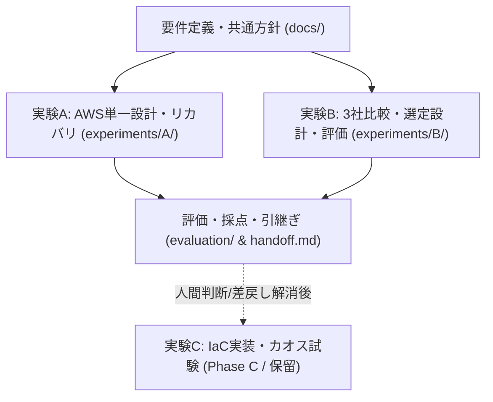
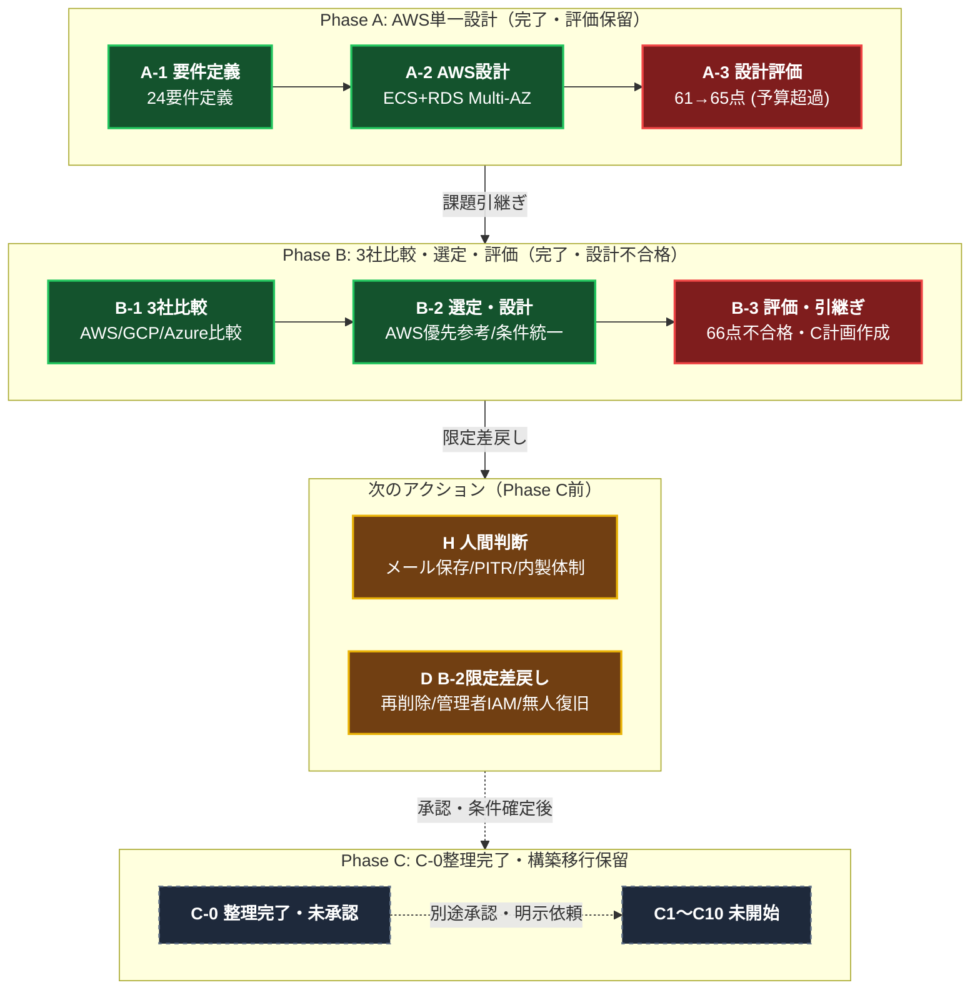
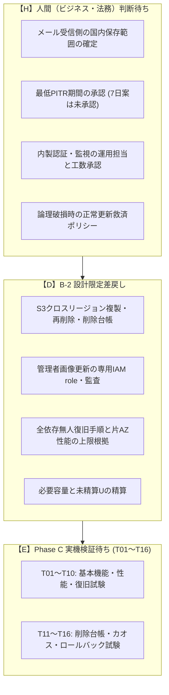
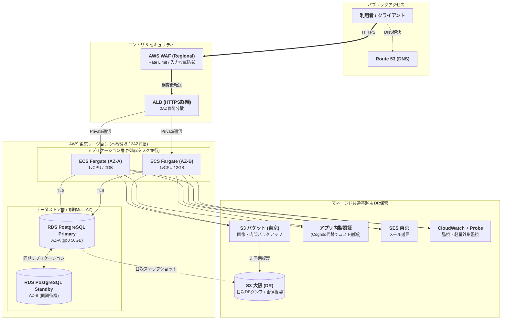

# クラウドアーキテクチャ検証 LEVEL3（Phase A〜Phase B-3 総合結果）

**最新：[C-1 read-only preflight](evaluation/C-1-read-only-preflight-run.md) はINCOMPLETE（AWS API 0回）** — 実profile、期待account ID、実験ID、private暗号化証跡先のbinding不足をAPI前に検出し停止。30分/6時間枠は未開始です。設計不合格66/66/66、LC1未採点、C全体移行保留・C-1実証未完了を維持します。

  <b>曖昧なビジネス要件・制約から自律型AIが実践的クラウド構成を設計・評価するLEVEL3検証</b>

  <a href="experiments/B/README.md"><b>🚀 開発者向けB結果サマリー</b></a> │
  <a href="experiments/B/final-report.md"><b>📊 B詳細レポート</b></a> │
  <a href="experiments/B/B-3/README.md"><b>📝 B-3成果物（採点・C計画）</b></a> │
  <a href="experiments/B/B-2/README.md"><b>📋 B-2条件別設計</b></a> │
  <a href="handoff.md"><b>📌 最新引継ぎ（handoff）</b></a>

---

## 1. エグゼクティブサマリー（B-3完了時点）

| 評価項目 | 現在のステータス | 判定・開発者にとっての意味 |
|---|---|---|
| **検証進捗** | **B-3（評価・引継ぎ）完了** | B-1（3社比較）→ B-2（条件別設計）→ B-3（正式採点・レポート）を完了 |
| **設計自己評価スコア** | **66点 / 100点** | 合格基準80点に未達のため **「設計不合格」**（初回66点・修正後66点） |
| **クラウド選定** | **AWSを優先参考設計として選定** | ただし最終選定・人間の採用承認は **「保留」**（B-2限定差戻し待ち） |
| **月額基本費用概算** | **AWS: 83,248円 ＋ U** | 月額上限10万円に対し基本枠内（余地約1.68万円）。未精算Uと追加要件で変動 |
| **次工程の扱い** | **B-2限定差戻し（D）** | **Phase C（実機・カオス試験）へは自動移行せず保留**。人間判断（H）の確定が必要 |

> [!IMPORTANT]
> **「文書工程の完了」と「設計合格・採用承認」は別です。**
> B-3までの検証により、3社の比較根拠・AWS優先参考設計・配点別課題・C検証計画が揃いましたが、必須要件（国内データ保存・完全削除・無人復旧・運用体制）の成立根拠が不足しているため、合格基準（80点）未達の **66点（不合格）** を維持しています。

---

## 2. プロジェクト概要と全体実験フロー

- **目的**: 曖昧なビジネス要件に対し、AIが適切な要件定義、アーキテクチャ選定、コスト見積、耐障害・運用設計を行えるかの検証
- **指定モデル**: GPT-6 Astra Light（実行モデル識別情報は未確認）
- **クラウド実リソース**: 未作成（Phase A / B はペーパー設計・評価のみ。利用費0円）

### リポジトリ構造と実験フロー

### 全工程のステータス一覧

| 工程 | 状態 | 自己評価 | 主な結果と次の扱い | 関連成果物 |
|---|---|:---:|---|---|
| **Phase A** | 完了 | 65 / 100 | AWS単一設計。外形監視費用の計上漏れ発覚により月額10万円超過で不合格。 | [A詳細レポート](experiments/A/final-report.md) |
| **B-1** | 完了 | - | 3社（AWS/GCP/Azure）を同一負荷条件で比較。暫定順位: AWS > GCP > Azure。 | [B-1サマリー](experiments/B/B-1/README.md) |
| **B-2** | 完了 | 66 / 100 | 7日PITR共通条件案でAWSを優先参考設計化。最終選定・採用承認は保留。 | [B-2設計](experiments/B/B-2/README.md) |
| **B-3** | 完了 | **66 / 100** | 24要件追跡・配点別レビュー・限定修正・C計画作成。**設計不合格・C移行保留**。 | [B詳細レポート](experiments/B/final-report.md) |
| **次工程** | 待機 | - | **人間判断待ち（H）とB-2限定差戻し（D）** を実施。Cへの自動移行なし。 | [handoff.md](handoff.md) / [#9](https://github.com/moruku36/cloud-validation-level3-astra-light/issues/9) |
| **Phase C** | 保留 | - | IaC・実機デプロイ・カオス試験。短期計画12,495円＋Uは未承認。 | [C検証計画](experiments/B/B-3/c-validation-plan.md) |

---

## 3. 3クラウド比較とコスト推移（B-1 → B-2/B-3）

3社共通条件（初期1万人、月間100万PV、通常10/peak 100 RPS、外向き200GB、国内保存、為替150円/USD、税10%）での月額費用推移：

| クラウド | B-1 税込基本月額 | B-2/B-3 税込基本月額 | 予算（10万円）判定 | 主な変動理由・採用状況 |
|---|---:|---:|:---:|---|
| **AWS** (優先参考) | **76,034 円** | **83,248 円 ＋ U** | **枠内**（余地 16,752円） | 非本番入口常設化、監視、DR資材追加。最安値だが未精算Uあり |
| **Google Cloud** | 135,580 円 | 101,933 円 ＋ U | 超過（1,933円オーバー） | Cloud SQL Enterprise化・東京LB補正により約3.3万円圧縮も予算超 |
| **Azure** | 216,493 円 | 218,588 円 ＋ U | 大幅超過（11.8万円オーバー） | コンテナ/DBのマネージド単価が高く、現行要件では予算大幅超過 |

> [!NOTE]
> **「＋ U」について**: 未精算費用（ログ流量、メトリクス数、データ転送の超過分、バックアップ保持量、追加セキュリティ設定等）を指します。AWSの残余16,752円はUの精算や要件強化によって容易に消費される可能性があります。

---

## 4. なぜ66点（不合格）なのか？（B-3レビュー指摘 F01〜F11）

合格基準である総合80点、および重点項目（Architecture, Security/IAM, Availability, Cost, Backup/DR）での「4以上」に対し、すべて「3」に留まりました。

### 主な未解決課題と差戻し事項

1. **データ主権・保存境界（F04 / REQ-08, 16）**:
   - メール送信（SES）において、受信側メールサーバーでの国内保存境界が未定義。
   - Route 53 Query Loggingが国内保存対象外となるため、代替の監査・監視経路の設計が必要。
2. **退会削除・保持期限の不整合（F02 / REQ-07, 16, 23）**:
   - 要件の「退会30日以内削除」に対し、バックアップ（PITR 7日〜35日）やクロスリージョン複製先での再削除メカニズムが実証・設計不足。
3. **夜間無人復旧と片AZ性能（F05 / REQ-06, 09, 10）**:
   - 平日専任1名・夜間即応なし体制において、全依存障害からの完全自動復旧（RTO 30分・RPO 5分・300秒安定）の根拠が不足。
   - 単一AZ障害時に片側AZだけでピーク負荷（100 RPS）を処理しきれるかの性能根拠が未確認。
4. **内製化による運用負荷（F07 / REQ-13, 14, 18）**:
   - コスト削減のために認証やCanary監視を自前実装（ECS/Lambda）とした結果、専任1名での運用・保守負荷が過大となる懸念。

---

## 5. 次工程への引継ぎ（担当別タスク）

未解決事項は [Issue #9](https://github.com/moruku36/cloud-validation-level3-astra-light/issues/9) および [handoff.md](handoff.md) で追跡されています。

---

## 6. アーキテクチャ概要 (AWS優先参考設計)

専任1名の運用負荷を抑えつつ、同期整合性（SQL）と夜間の自動復旧を両立するため、**AWS Fargate (ARM) + Amazon RDS PostgreSQL (Multi-AZ)** をベースとしています。

### システム構成図

  
   
  🔍 <b>画像をタップ/クリックすると別タブで原寸大・高解像度表示されます</b>

#### 論理構成図 (Mermaid)

### 主要コンポーネントと選定理由
- **DNS / ネットワーク**: Route 53 (DNSルーティング) + ALB (HTTPS終端・2AZ負荷分散)
- **セキュリティ**: AWS WAF (Rate Limit・SQLi防御)
- **コンテナ基盤**: AWS Fargate (ARM Graviton, 1vCPU / 2GB × 2AZ)。EKSは専任1名での運用複雑性を考慮し不採用。
- **データストア**: Amazon RDS for PostgreSQL (`db.t4g.medium`, gp3 50GB, Multi-AZ)。スタンバイ系への自動フェイルオーバー（60〜120秒）。
- **認証**: アプリ内製認証（Cognitoコストを削減しつつ国内完結）。
- **バックアップ / DR**: 大阪リージョンへのS3クロスリージョン複製および日次スナップショット転送（Cold DR）。

---

## 7. ドキュメントマップ

### 企画・要件・共通ルール (`docs/`)
- [要件定義・全体方針](docs/requirements.md) : ビジネス背景、24要件、制約条件の整理
- [実行ポリシー](docs/execution-policy.md) : AIエージェントの作業手順・禁止事項・評価方針
- [正式業務回答](docs/sources/business-answers-2026-09-08.md) : ヒアリングに対する顧客側の正式回答
- [ADR意思決定記録](docs/decisions/ADR-A2-001.md) : 初期アーキテクチャ選定理由

### Phase B: 3クラウド比較・選定設計・総合評価 (`experiments/B/`)
- [**★ LEVEL3-B 開発者向け結果サマリー**](experiments/B/README.md) : **B工程全体（B-1〜B-3）の要約と開発者向け解説**
- [**★ LEVEL3-B 詳細レポート**](experiments/B/final-report.md) : **比較・設計・評価の正式統合レポート**
- **B-1: 3クラウド比較フェーズ**
  - [B-1 サマリー](experiments/B/B-1/README.md) / [3社比較詳細](experiments/B/B-1/comparison.md) / [費用内訳](experiments/B/B-1/cost.md) / [比較基準](experiments/B/B-1/comparison-criteria.md) / [公式出典](experiments/B/B-1/sources.md)
- **B-2: 条件別設計フェーズ**
  - [B-2 サマリー](experiments/B/B-2/README.md) / [設計書](experiments/B/B-2/design.md) / [費用モデル](experiments/B/B-2/cost.md) / [選定理由・逆転条件](experiments/B/B-2/selection.md) / [復旧・可観測性](experiments/B/B-2/recovery-observability.md) / [実証対応計画](experiments/B/B-2/validation-plan.md)
- **B-3: 評価・引継ぎフェーズ**
  - [B-3 成果物トップ](experiments/B/B-3/README.md) / [配点別採点表 (66点)](experiments/B/B-3/scores.md) / [レビュー指摘 (F01〜F11)](experiments/B/B-3/review.md) / [限定修正](experiments/B/B-3/revised-design.md) / [24要件追跡](experiments/B/B-3/traceability.md) / [Phase C検証計画](experiments/B/B-3/c-validation-plan.md)

### Phase A: AWS単一クラウド検証 (`experiments/A/`)
- [LEVEL3-A 総合検証結果レポート](experiments/A/final-report.md) : A-1〜A-3の全結果・採点・課題
- [A実行完了報告](experiments/A/completion-report.md) : A完了時の引継ぎ記録
- **A-1**: [24要件一覧](experiments/A/A-1/requirements.md) / [質疑応答台帳](experiments/A/A-1/questions.md) / [リスク・仮定](experiments/A/A-1/assumptions-risks.md)
- **A-2**: [AWS基本設計](experiments/A/A-2/design.md) / [構成図](experiments/A/A-2/diagram.md) / [復旧・運用](experiments/A/A-2/recovery-operations.md) / [初期費用](experiments/A/A-2/cost.md)
- **A-3**: [自己評価スコア (61→65点)](experiments/A/A-3/scores.md) / [改善仕様](experiments/A/A-3/revised-design.md) / [予算監査](experiments/A/A-3/budget.md) / [要件追跡](experiments/A/A-3/traceability.md)

### 評価プロセス・運用記録 (`evaluation/`)
- [B-3 実行記録](evaluation/B-3-run.md) / [B-2 実行記録](evaluation/B-2-run.md) / [B-1 実行記録](evaluation/B-1-run.md)
- [A-3 実行記録](evaluation/A-3-run.md) / [A-2 実行記録](evaluation/A-2-run.md) / [A-1 実行記録](evaluation/A-1-run.md)
- [人間の介入記録台帳](evaluation/human-intervention.md) : AIの自律性と介入記録
- [評価ルーブリック](evaluation/rubric.md) : 採点基準定義

### 引継ぎ・資産管理
- [**最新引継ぎ書 (handoff.md)**](handoff.md) : 現在の状態、保留事項、次工程の起点
- [資源台帳 (resource-inventory.md)](resource-inventory.md) : クラウド残存リソース0件・利用費0円の記録
