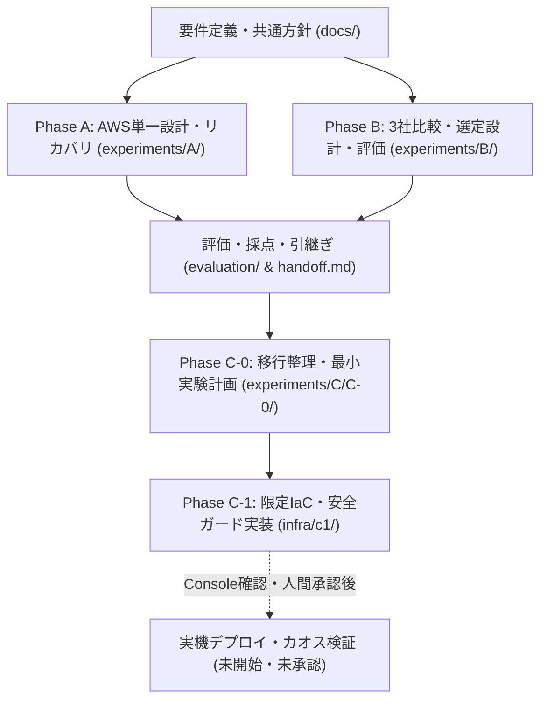
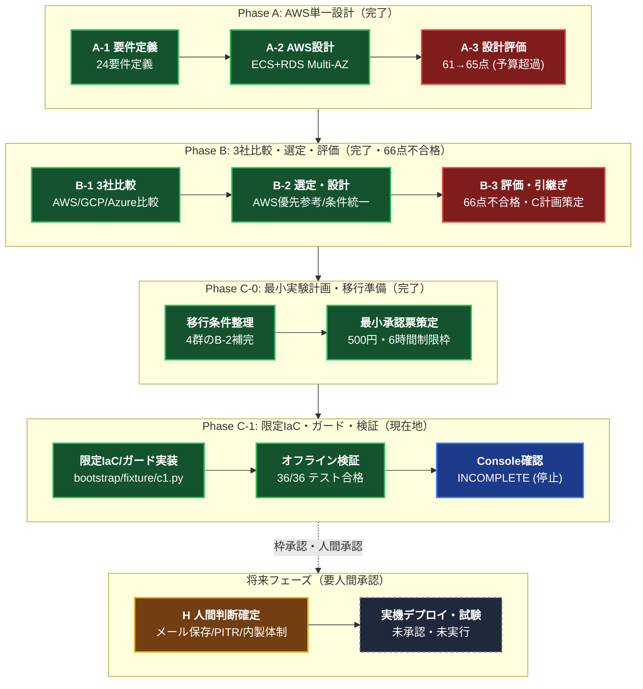
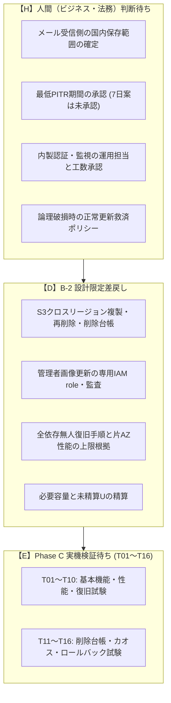
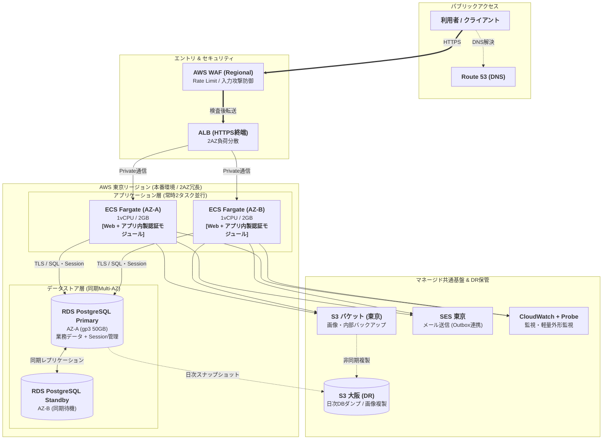

# クラウドアーキテクチャ検証 LEVEL3（Phase A〜Phase C-1 総合結果）

> [!IMPORTANT]
> **現在地・最新ステータス（Phase C-1 安全停止中）**
> - **IaC・ガード実装**: [`infra/c1/`](infra/c1/README.md) にてTerraformおよびPythonガード実装完了。**ユニットテスト 36/36 件 PASS**。
> - **クラウド接続**: **AWS実リソース未作成・課金0円**。未承認の live 操作はガードにより全て遮断。
> - **直近の進捗**: [Console read-only事前確認](evaluation/C-1-console-readonly-check-run.md)は20分枠超過のため `INCOMPLETE` で安全停止。設定変更・API実行・実環境リソース変更は一切行われていません。
> - **次工程**: 新たな閲覧枠の人間承認、または [Issue #9](https://github.com/moruku36/cloud-validation-level3-astra-light/issues/9) に記載された人間判断事項（H）の確定待ち。

> **English Summary**: Autonomous cloud architecture validation repository. Currently at **Phase C-1 (safely halted)**. Local Terraform code and Python multi-layered safety guards are completed with **36/36 tests passing**. **0 cloud resources created ($0 cost)**. All unapproved AWS live operations are strictly blocked by offline guards.

### 🚦 エンジニア向け作業境界（Do / Don't）

| 区分 | 許可される作業（Do） | 禁止・未承認の作業（Don't） |
|---|---|---|
| **ローカル環境** | ✅ `python -m unittest discover -s infra/c1/tests -v`<br/>✅ `terraform validate`（`-backend=false`）<br/>✅ ドキュメント・コードの改修・リファクタリング | ❌ 秘密情報・実アカウントID・ARNのコミット |
| **クラウド環境** | （なし：実機操作はすべて未承認） | ❌ AWS API / CLI 呼び出し（STS・S3等含む）<br/>❌ マネジメントコンソールでの設定変更・作成<br/>❌ `terraform apply`（本番・テスト環境とも） |

### 📖 推奨読解フロー（初見のエンジニアはここから順に読む）

1. [**要件定義の正本** (`docs/requirements.md`)](docs/requirements.md) : ビジネス制約と **24要件一覧表（REQ-01〜24）**
2. [**現行アーキテクチャ設計書** (`experiments/B/B-2/design.md`)](experiments/B/B-2/design.md) : AWS優先参考設計・内製認証・容量・データ経路
3. [**主要意思決定 ADR** (`docs/decisions/ADR-B2-001.md`)](docs/decisions/ADR-B2-001.md) : なぜCognitoをやめて内製認証にしたのか
4. [**C-1 実装コードと安全手順書** (`infra/c1/README.md`)](infra/c1/README.md) : Terraform・二重ガードスクリプト・ローカル検証
5. [**最新引継ぎ書** (`handoff.md`)](handoff.md) : 現在の停止状態・次に行うべき1作業
※ 略語・記号（H/D/E、U、LC1、CP1等）の意味は [**用語集（docs/glossary.md）**](docs/glossary.md) を参照。

<p align="center">
  <a href="#7-エンジニア向けクイックスタート-ローカルテスト検証"><b>⚡ クイックスタート</b></a> │
  <a href="infra/c1/README.md"><b>🛠️ C-1 IaC・ガード実装</b></a> │
  <a href="experiments/B/README.md"><b>🚀 B結果サマリー</b></a> │
  <a href="experiments/B/final-report.md"><b>📊 B詳細レポート</b></a> │
  <a href="handoff.md"><b>📌 最新引継ぎ（handoff）</b></a>
</p>

---

## 1. エグゼクティブサマリー（C-1準備・停止時点）

| 評価項目 | 現在のステータス | 判定・開発者にとっての意味 |
|---|---|---|
| **検証進捗** | **Phase C-1（ローカル準備完了・実機停止中）** | A（単一設計）→ B（3社比較・選定・評価）→ C-0（計画）→ C-1（IaC・ガード実装） |
| **設計自己評価スコア** | **66点 / 100点** | 合格基準80点に未達のため **「設計不合格・保留」**（B-3時点で66点確定） |
| **クラウド選定** | **AWSを優先参考設計として選定** | ただし最終選定・人間の採用承認は **「保留」**（B-2限定差戻し事項あり） |
| **現行採用見積もり** | **AWS: 83,248円 ＋ U / 月** | 予算上限10万円に対し基本枠内（余地約1.68万円）。未精算Uで変動（[詳細](#3-現行コスト見積もりと3クラウド比較)） |
| **実機リソース・利用費** | **0件 / 0円（完全未作成）** | 厳格な安全ガード（`c1.py`）により未承認のAPIコールやリソース作成を完全抑止 |
| **実装コード品質** | **ユニットテスト 36/36 通過** | オフラインガード・設定検証・ロール照合テストすべて合格 |
| **次工程の扱い** | **人間承認待ち（Console確認 / H判断）** | **実環境適用（apply）へは自動移行せず停止**。安全手順に則った承認が必要 |

> [!NOTE]
> **「文書・コード準備の完了」と「実機実行の承認」は厳格に分離されています。**
> Phase C-1においてローカルIaCおよび二重ガードスクリプトが完成していますが、必須要件（国内データ保存・完全削除・無人復旧・運用体制）の人間判断および実環境での事前確認が未完了のため、実機操作は一切行わず安全停止しています。


---

## 2. プロジェクト概要と全体実験フロー

- **目的**: 曖昧なビジネス要件に対し、AIが適切な要件定義、アーキテクチャ選定、コスト見積、耐障害・運用設計、および安全なIaC実装を行えるかの検証
- **指定モデル**: GPT-6 Astra Light（実行モデル識別情報は未確認）
- **クラウド実リソース**: 未作成（Phase A / B / C-0 / C-1 全てにおいてペーパー設計・ローカル検証のみ。利用費0円）

### リポジトリ構造と実験フロー





### 全工程のステータス一覧

| 工程 | 状態 | 自己評価 | 主な結果と次の扱い | 関連成果物 |
|---|---|:---:|---|---|
| **Phase A** | 完了 | 65 / 100 | AWS単一設計。外形監視費用の計上漏れ発覚により月額10万円超過で不合格。 | [A詳細レポート](experiments/A/final-report.md) |
| **Phase B (B-1〜B-3)** | 完了 | **66 / 100** | 3社比較・AWS優先参考設計・24要件追跡。**設計不合格・C移行保留**。 | [B詳細レポート](experiments/B/final-report.md) |
| **Phase C-0** | 完了 | 準備判定B | 4群のB-2設計補完、500円/6h限定実験承認票（CP1/CP2）策定。文書完了。 | [C-0 整理文書](experiments/C/C-0/README.md) |
| **Phase C-1** | **進行中（停止）** | - | 限定IaC・多重防御ガード実装（36テストPASS）。Console確認時間枠超過で安全停止。 | [C-1 README](infra/c1/README.md) / [実行記録](evaluation/C-1-console-readonly-check-run.md) |
| **未解決事項** | 継続追跡 | - | **人間判断待ち（H）とB-2限定差戻し（D）** をIssue #9で継続管理。 | [handoff.md](handoff.md) / [Issue #9](https://github.com/moruku36/cloud-validation-level3-astra-light/issues/9) |

---

## 3. 現行コスト見積もりと3クラウド比較

### 3.1 採用中の現行見積もり (AWS優先参考設計: B-2/B-3)

月額予算 **税込 100,000 円 / 月** に対する、現在の正式な採用見積もりです：

| 構成区分 | 月額概算（税込） | 内訳・主要リソース |
|---|---:|---|
| **基本月額費用** | **83,248 円** | ECS Fargate 2タスク（常時2AZ）+ RDS PostgreSQL Multi-AZ + ALB/WAF + S3 + SES + 非本番常設分 |
| **未精算変動枠（＋ U）** | 変動（要精算） | ログ流量、メトリクス数、データ転送超過分（200GB超）、バックアップ保持量、追加監査等 |
| **予算枠残余（バッファ）** | **16,752 円** | 未精算費用「＋ U」の吸収余力。要件追加により消費される可能性あり |

> [!NOTE]
> **「＋ U」の詳細内訳**:
> - CloudWatch Logs / メトリクス流量（ログ量に応じた従量課金）
> - Route 53 クエリログ・追加ヘルスチェック
> - 外部転送量（基本設計の200GB/月を超過した分）
> - S3 バックアップの世代管理・ライフサイクル移行費用
> ※ 各クラウド共通条件（初期1万人、月間100万PV、通常10/peak 100 RPS、外向き200GB、国内保存、為替150円/USD、税10%）

### 3.2 3クラウド比較と見積もりの変遷（履歴）

| クラウド | A-2初期案 (AWSのみ) | B-1 3社概算 | B-2/B-3 正式見積 | 予算判定 | 備考・採否理由 |
|---|---:|---:|---:|:---:|---|
| **AWS** (優先参考) | 82,682 円 | 76,034 円 | **83,248 円 ＋ U** | **枠内** | 最安値。非本番常設化・Probe監視・DR資材追加で適正化 |
| **Google Cloud** | — | 135,580 円 | 101,933 円 ＋ U | 超過 (+1,933円) | Cloud SQL Enterprise化・東京LB補正で約3.3万円削減もわずかに足が出た |
| **Azure** | — | 216,493 円 | 218,588 円 ＋ U | 大幅超過 (+11.8万円) | コンテナ・DBのマネージド基本単価が高く現行予算では非現実的 |

---

## 4. なぜ66点（不合格）なのか？（B-3レビュー指摘 F01〜F11）

合格基準である総合80点、および重点項目（Architecture, Security/IAM, Availability, Cost, Backup/DR）での「4以上」に対し、すべて「3」に留まりました。

### 主な未解決課題と差戻し事項

1. **データ主権・保存境界（F04 / REQ-08, 16）**:
   - メール送信（SES）において、受信側メールサーバーでの国内保存境界が未定義。
   - Route 53 Query Loggingが国内保存対象外となるため、代替の監査・監視経路の設計が必要。
2. **退会削除・保持期限の不整合（F02 / REQ-07, 16, 23）**:
   - 要件の「退会30日以内削除」に対し、バックアップ（PITR 7日〜35日）やクロスリージョン複製先での再削除メカニズムが実証・設計不足。
3. **夜間無人復旧と片AZ性能（F05 / REQ-06, 09, 10）**:
   - 平日専任1名・夜間即応なし体制において、全依存障害からの完全自動復旧（RTO 30分・RPO 5分・300秒安定）の根拠が不足。
   - 単一AZ障害時に片側AZだけでピーク負荷（100 RPS）を処理しきれるかの性能根拠が未確認。
4. **内製化による運用負荷（F07 / REQ-13, 14, 18）**:
   - コスト削減と国内保存のため認証を内製化（[ADR-B2-001](docs/decisions/ADR-B2-001.md)）した結果、専任1名での運用・保守負荷が過大となる懸念。

---

## 5. 次工程への引継ぎ（担当別タスク）

未解決事項は [Issue #9](https://github.com/moruku36/cloud-validation-level3-astra-light/issues/9) および [handoff.md](handoff.md) で追跡されています。



---

## 6. アーキテクチャ概要 (AWS優先参考設計)

専任1名の運用負荷を抑えつつ、同期整合性（SQL）と夜間の自動復旧を両立するため、**AWS Fargate (ARM) + Amazon RDS PostgreSQL (Multi-AZ)** をベースとしています。
認証はCognitoの将来コスト急増リスクと国内保存制約を回避するため、**アプリ内製認証（PostgreSQLセッション連携）** を採用しています（[ADR-B2-001](docs/decisions/ADR-B2-001.md)）。

### 6.1 現行論理構成図 (B-2/B-3 正本)



### 6.2 初期設計案（A-2）の構成図スナップショット

<details>
<summary><b>📷 初期設計案（Phase A / A-2）のアーキテクチャ画像を表示（クリックで展開）</b></summary>
<br>

<p align="center">
  <a href="https://raw.githubusercontent.com/moruku36/cloud-validation-level3-astra-light/main/experiments/A/A-2/architecture.jpg" target="_blank" title="クリックして高解像度表示">
    
  </a>
  <br>
  <sub>※ 本画像は Phase A (A-2) 当初に作成されたスナップショットです。現行設計（B-2/B-3）では、Cognitoが「アプリ内製認証モジュール（PostgreSQLサーバーサイドセッション）」へ改定されています。</sub>
</p>

</details>


### 主要コンポーネントと選定理由
- **DNS / ネットワーク**: Route 53 (DNSルーティング) + ALB (HTTPS終端・2AZ負荷分散)
- **セキュリティ**: AWS WAF (Rate Limit・SQLi防御)
- **コンテナ基盤**: AWS Fargate (ARM Graviton, 1vCPU / 2GB × 2AZ)。EKSは専任1名での運用複雑性を考慮し不採用。
- **データストア**: Amazon RDS for PostgreSQL (`db.t4g.medium`, gp3 50GB, Multi-AZ)。スタンバイ系への自動フェイルオーバー（60〜120秒）。
- **認証**: アプリ内製認証（Cognitoコストを削減しつつ国内完結）。
- **バックアップ / DR**: 大阪リージョンへのS3クロスリージョン複製および日次スナップショット転送（Cold DR）。

---

## 7. エンジニア向けクイックスタート (ローカルテスト・検証)

リポジトリ内のコードはすべて**クラウド非接続（オフライン）**で安全に検証可能です。

### 7.1 Python 安全ガード・ユニットテスト実行

多重防御ガード（時間・費用・ロール照合・STS構造検査・暗号化確認）のテストスイートを実行します：

```bash
# 標準 unittest による実行（36件のテスト）
python -m unittest discover -s infra/c1/tests -v
```

### 7.2 Terraform 構成バリデーション

Terraformコード（Terraform 1.13.5 / AWS Provider 6.14.1 対応）の文法・構文チェック：

```bash
# フォーマットチェック
terraform fmt -check -recursive infra/c1

# bootstrap stack の構文検証（リモート接続なし）
terraform -chdir=infra/c1/bootstrap init -backend=false -input=false
terraform -chdir=infra/c1/bootstrap validate

# fixture stack の構文検証（リモート接続なし）
terraform -chdir=infra/c1/fixture init -backend=false -input=false
terraform -chdir=infra/c1/fixture validate
```

### 7.3 スクリプト体系 (`infra/c1/scripts/`)

| スクリプト | 役割 | オフライン動作 |
|---|---|:---:|
| [`c1.py`](infra/c1/scripts/c1.py) | 入力値・承認票・実行時間・予算・ロール二重ガード CLI | ○ (`check-config`) |
| [`tf_steps.py`](infra/c1/scripts/tf_steps.py) | Terraformバイナリ・コードhash照合と段階的apply制御 | ○ |
| [`probes.py`](infra/c1/scripts/probes.py) | 合成CanaryによるIAM拒否確認・S3ロック競合対照 | ○ (mock可) |
| [`materialize.py`](infra/c1/scripts/materialize.py) | 非公開設定JSONからtfvars/backendをオフライン安全生成 | ○ |

---

## 8. ドキュメントマップ

エンジニアが目的のドキュメントを迅速に探せるよう、「設計・仕様正本」と「実験オペレーションログ」を明確に分離しています。

### 8.1 企画・要件・共通ルール・用語集 (`docs/`)
- [**要件定義の正本 (24要件一覧含む)**](docs/requirements.md) : ビジネス制約、24要件（REQ-01〜24）、受入条件の正本
- [**用語集・略語集 (Glossary)**](docs/glossary.md) : H/D/E、U、LC1、CP1/CP2、G0〜G11等の用語・略語一覧
- [**ADR-B2-001: アプリ内製認証の正式採用**](docs/decisions/ADR-B2-001.md) : **【現行正本】** Cognito代替・国内保存・コスト抑制の決定理由
- [ADR-A2-001: 初期アーキテクチャ選定 (Superseded)](docs/decisions/ADR-A2-001.md) : A-2初期案（Fargate+RDS Multi-AZ等）
- [実行ポリシー](docs/execution-policy.md) : 作業手順・禁止事項・評価方針
- [正式業務回答](docs/sources/business-answers-2026-09-08.md) : ヒアリングに対する顧客側の正式回答
- [LICENSE (MIT License)](LICENSE) : リポジトリのライセンス

### 8.2 設計・アーキテクチャ成果物 (`experiments/` & `infra/c1/`)

#### 【Phase C】限定IaC・安全ガード実装
- [**★ C-1 実装コードと安全手順書 (infra/c1/README.md)**](infra/c1/README.md) : **Terraform・二重ガードスクリプト・実行runbook**
- [12段階実行ゲート](infra/c1/execution-gates-2026-09-12.md) / [計画差分と残条件](infra/c1/changes-and-gates.md)
- [Operator認証ガード設計](infra/c1/operator-authentication.md) / [IAM Identity Center事前審査](infra/c1/identity-center-precheck.md)
- [Permission Sets設計](infra/c1/identity-center-permission-sets.md) / [有効化ゲート](infra/c1/identity-center-activation-gates.md)
- [Private Binding安全設定手順](infra/c1/private-binding-setup.md)
- [C-0 最小実験計画 (CP1)](experiments/C/C-0/minimal-experiment.md) / [CP2 承認反映](experiments/C/C-0/approval-2026-09-12.md) / [費用モデル](experiments/C/C-0/minimal-cost-model.json)

#### 【Phase B】3クラウド比較・選定設計・総合評価
- [**★ LEVEL3-B 詳細レポート**](experiments/B/final-report.md) : **比較・設計・評価の正式統合レポート**
- [**★ LEVEL3-B 開発者向け結果サマリー**](experiments/B/README.md) : B工程全体（B-1〜B-3）の要約解説
- **B-2 (現行優先参考設計)**: [B-2 設計書](experiments/B/B-2/design.md) / [費用モデル](experiments/B/B-2/cost.md) / [選定理由](experiments/B/B-2/selection.md) / [限定補完サマリー](experiments/B/B-2/limited-completion/README.md)
- **B-3 (総合レビュー・採点)**: [配点別採点表 (66点)](experiments/B/B-3/scores.md) / [レビュー指摘 (F01〜F11)](experiments/B/B-3/review.md) / [24要件追跡](experiments/B/B-3/traceability.md) / [C検証計画](experiments/B/B-3/c-validation-plan.md)
- **B-1 (3社比較)**: [3社比較詳細](experiments/B/B-1/comparison.md) / [費用内訳](experiments/B/B-1/cost.md)

#### 【Phase A】初期AWS単一設計スナップショット
- [LEVEL3-A 総合検証結果レポート](experiments/A/final-report.md) : A-1〜A-3の全結果・採点
- [A-2 AWS基本設計（初期案）](experiments/A/A-2/design.md) / [初期費用](experiments/A/A-2/cost.md) / [A-1 要件スナップショット](experiments/A/A-1/requirements.md)

### 8.3 実験オペレーションログ・実行記録 (`evaluation/` & 引継ぎ)

- [**最新引継ぎ書 (handoff.md)**](handoff.md) : **現在の停止状態・作業境界（Do/Don't）・次に行うべき1手**
- [**資源・費用台帳 (resource-inventory.md)**](resource-inventory.md) : クラウド残存リソース0件・利用費0円の監査記録
- **Phase C 実行ログ**:
  - [Console read-only確認 (INCOMPLETE)](evaluation/C-1-console-readonly-check-run.md)
  - [IAM Identity Center審査](evaluation/C-1-identity-center-precheck-run.md)
  - [Operator認証ガード検証 (36/36 PASS)](evaluation/C-1-operator-auth-guard-run.md)
  - [Private Binding記録 (NOT_READY)](evaluation/C-1-private-binding-run.md)
  - [Read-only Preflight記録 (INCOMPLETE)](evaluation/C-1-read-only-preflight-run.md)
  - [C-1 準備検証記録](evaluation/C-1-preparation-run.md) / [C-0 最小承認記録](evaluation/C-0-minimal-approval-run.md)
- **Phase A/B 実行ログ・監査**:
  - [B-3 実行記録](evaluation/B-3-run.md) / [B-2 実行記録](evaluation/B-2-run.md) / [B-1 実行記録](evaluation/B-1-run.md)
  - [A-3 実行記録](evaluation/A-3-run.md) / [A-2 実行記録](evaluation/A-2-run.md) / [A-1 実行記録](evaluation/A-1-run.md)
  - [人間の介入記録台帳](evaluation/human-intervention.md) : AIの自律性と人間介入の記録
  - [評価ルーブリック](evaluation/rubric.md) : 採点基準定義


