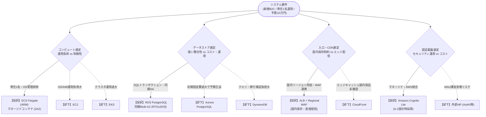

# ADR-A2-001：常時2AZのFargateと同期RDSを条件付き採用

2026-09-09。初回81cab82、算術表現訂正は後続commit。採用案はdesign.md、費用はcost.md、図はarchitecture.mmd。

|判断ID|要件ID|採用・不採用と理由|代替・見直し条件|
|---|---|---|---|
|D01|REQ-01,14,17|AはAWS。ECS/Fargate ARM、SQL/CRUDと運用保守削減。2AZ常時容量|EC2はOS運用増。Lambda/DynamoDBは有力だがcold start・クエリ/移行検証が必要。予算優位が確定なら再選定|
|D02|REQ-02,06,07,10,11|RDS PostgreSQL同期Multi-AZ、writer readで本人更新反映。Redis/replica初期なし|DB credit/接続/負荷で増量、NoSQLは固定アクセスパターンと移行費で再比較|
|D03|REQ-08,17|CloudFront不採用、東京ALB配信。WAF regional採用|国内cache保証のある方法/条件承認でCDN再評価。viewer geo制限を保存保証にしない|
|D04|REQ-12,16,18|public task＋ALB限定SGでNAT固定費削減。DB/S3はprivate|Public IP禁止は別変更。private endpoints/NATの費用増・egress到達性を検証|
|D05|REQ-03,08,09,16|東京Cognito Lite/SES、独自login UI、optional海外転送なし|受信メール保存地域・認証障害の上限が未確認。国内全コピー制約を満たせなければ未達/代替提案|
|D06|REQ-09,10,11,13|残存taskと同期standbyで夜間自動復旧。backupは別目的|性能・failover未実測、全managed依存の復旧上限保証なし。範囲ごとCで検証|
|D07|REQ-07,23,24|PITR35日・大阪cold copy、削除台帳で復元後再削除|論理破損4h/地域4〜12hは未実測。Cognito認証復旧・正常更新救済には限界|
|D08|REQ-04,05,15|PV/要求を分離、1000RPSと100万人は独立|CPU>50%、p95/connection/credit/storage/費用閾値で増強。人数のみで台数倍増しない|
|D09|REQ-12|税込小計82,682円、20%余裕込99,218円。厳密適合は条件付き|150円為替仮定・小費目枠・単task性能未確定。予備費だけで達成確定不可|
|D10|REQ-18,20,21,22|OIDC限定role、State国内非公開、CI環境承認/rollback、今回設計のみ|workflow権限未対応はC実装前。C-0許可なしに資源作成不可|
|D11|REQ-19|A-3採点・包括レビューは今回行わない|A-2文書保存完了と設計合格を分ける|

## アーキテクチャ意思決定ツリー

## 採択案 vs 却下案 比較マトリクス

| レイヤ | 採択アーキテクチャ | 比較・却下アーキテクチャ | 採択理由 | 却下理由 |
|---|---|---|---|---|
| **コンピュート** | **ECS on Fargate (ARM)** | 1. EC2 インスタンス 2. EKS (Kubernetes) 3. AWS Lambda | 専任1名での運用容易性、OS/AMIパッチ管理不要、常時2AZ稼働でコールドスタート回避 | 1. EC2: OS保守・パッチ・自動復旧運用が重い 2. EKS: 専任1名体制には運用複雑性が過大 3. Lambda: コールドスタート、RPS増加時の費用線形増 |
| **データストア** | **RDS for PostgreSQL (Multi-AZ)** | 1. Aurora PostgreSQL 2. DynamoDB (NoSQL) 3. シングルAZ RDS | 会員・お気に入り等のトランザクション整合性、SQL検索性、同期Multi-AZによるRTO 30分/RPO 0達成 | 1. Aurora: 初期最低費用が高く予算10万円を圧迫 2. DynamoDB: 検索・リレーション設計/移行負担大 3. シングルAZ: AZ障害時のRTO 30分を満たせない |
| **入口・CDN** | **ALB + AWS WAF (Regional)** | 1. CloudFront + WAF 2. NLB (L4) | 日本国内保存・転送保証、初期200GB規模での費用抑制、マネージドWAF連携 | 1. CloudFront: エッジキャッシュの国内完全保証が不明確、初期小規模では不要 2. NLB: WAF連携・L7パスベースルーティング不可 |
| **認証基盤** | **Amazon Cognito (Lite)** | 1. 外部IdP (Auth0等) 2. 独自認証 on DB | AWS統合・マネージド管理、パスワードハッシュ・セッション運用の自社負担削減 | 1. Auth0等: 将来のMAU課金によるコスト急増リスク 2. 独自認証: セキュリティパッチ・暗号鍵管理の専任1名負担過大 |

相互参照：[Issue #4](https://github.com/moruku36/cloud-validation-level3-astra-light/issues/4)。要件を緩和していない。採用はA-3レビューに出す推奨設計であり、本番展開の承認ではない。
