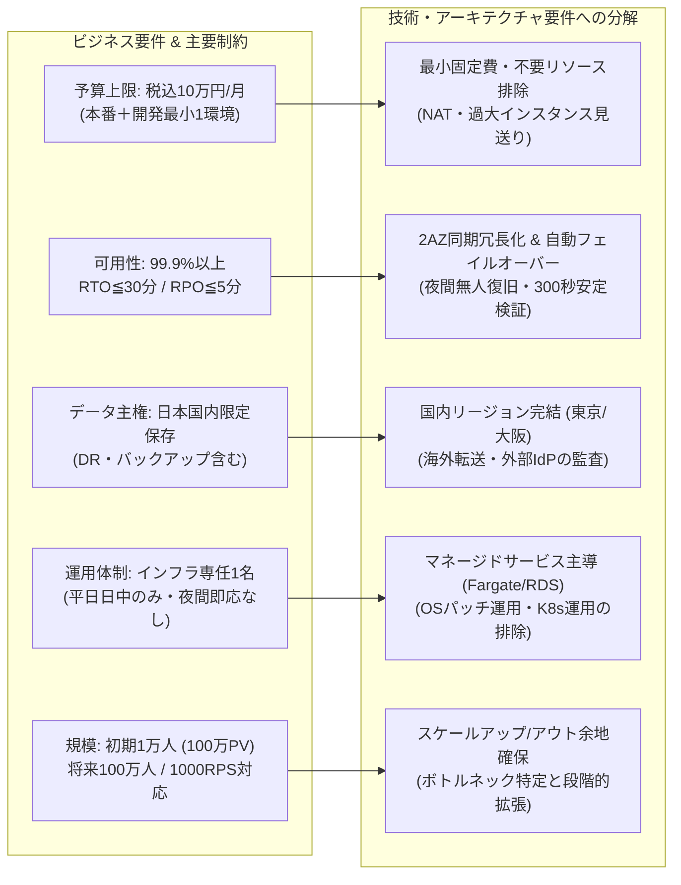

# クラウド検証LEVEL3 要件定義（取得範囲の整理）

出典：[ユーザー指定の共有チャット](https://chatgpt.com/s/cx_6a9fb8b9a1d081918765c68635003aa5)。確認日：2026-09-08（JST）。
取得証跡：[表示本文](sources/shared-chat.txt)。これは表示された本文の保存であり、非表示の文書・コードブロックを含む完全なエクスポートではない。
適用優先順位：この会話の最新のユーザー指示 → 既存の共通指示 → 共有チャットの要件。共有チャット内の例示を確定設計と扱わない。

## 原本で確認できた内容
- 目的：曖昧なビジネス要件・制約からAI自身が合理的なクラウド構成を判断できるか検証。
- A：指定された単一クラウドで設計。B：AWS・Azure・GCPを比較選定。C：実装・障害・変更への対応。
- 新規B2C、日本国内、初期ユーザー1万人・将来100万人、個人情報、24時間365日、可用性99.9%以上、RTO 30分、RPO 5分、開発5名・インフラ専任1名、初期月額10万円以内。
- 月間100万PV程度、アクセス10倍の例示。ユーザー数100倍からリクエスト数100倍と推定しない。
- 実行基盤、データストア、AZ・リージョン、CDN、WAF、IAM、DR、監視、IaC、CI/CD、運用等はAIの設計判断対象。特定サービス・台数の指定ではない。
- 評価観点：要件理解、Architecture妥当性、Security、Availability、Scalability、Cost、Operations、DR、Observability、Complexity、Vendor lock-in、Migration容易性、人間の修正量。5段階評価。
- 結果をすべてGitHubへ集約する依頼、分割実行と不要リソース削除の依頼を確認。
- モデルは実行画面でGPT-6 Astra Lightを選ぶ旨を確認。実行モデルの実測確認はできていない。

### 要件構造ツリー（ビジネス制約から技術要件への分解）

## 正式補足による統合

[正式補足要件](sources/supplement-2026-09-08.md)を不足部分の正式根拠として適用する。未取得原本は未取得のまま保持するが、追加の原本提示は進行条件ではなくなった。
- AはAWS指定。BはAWS/Azure/GCPを共通条件で再選定。
- 評価配点100点、5段階・合格基準、介入記録、GitHub集約・Issue管理は正式補足に従う。
- 初期シナリオ・共通指示は継続。A-1のみ実行し、重要回答未取得なら回答待ち。

## 旧文書との差分・矛盾の解消
|旧状態・記述|今回の優先内容|影響|
|---|---|---|
|原本本文・配点の取得が前提|正式補足で不足を補完|原本待ちの阻害を解除。取得成功とは記録しない|
|Aクラウド未指定|AのみAWS|BにAWS優先を持ち込まない|
|人間の修正量も評価観点の例示|指定11項目で100点、介入は別記録|介入を加点・減点の独自配点にしない|
|ローカルのみの準備履歴に未指定表記|保存先PUBLIC確定、補足受領済み|過去スナップショットは変更せず現在文書で更新|

明示的な数値要件の矛盾は確認していない。可用性・DR・予算・運用の両立は対象範囲が未確定で、成立を断定しない。

## 実行範囲・文書分担
実行共通指示は[execution-policy.md](execution-policy.md)、正式追加条件・評価は[補足](sources/supplement-2026-09-08.md)。A-1は統合コミットのGitHub反映確認後に開始済み。後続工程の設計・評価は先取りしない。

## A-1成果物

[要件整理表](../experiments/A/A-1/requirements.md)、[質問](../experiments/A/A-1/questions.md)、[リスク](../experiments/A/A-1/assumptions-risks.md)、[追跡性](../experiments/A/A-1/traceability.md)。正式回答で重大不足解消、A-1要件整理完了。[Issue #2](https://github.com/moruku36/cloud-validation-level3-astra-light/issues/2)。

## 正式業務回答（今回優先）

[業務回答](sources/business-answers-2026-09-08.md)を正式な共通検証条件として統合。実在サービスの確定情報ではない。旧未回答・仮定を更新。単一AZまで30分/5分、論理破損は4時間暫定、地域停止は別枠、税込本番＋最小非本番10万円を明確化。これはユーザー承認の具体化でありAIによる緩和ではない。
