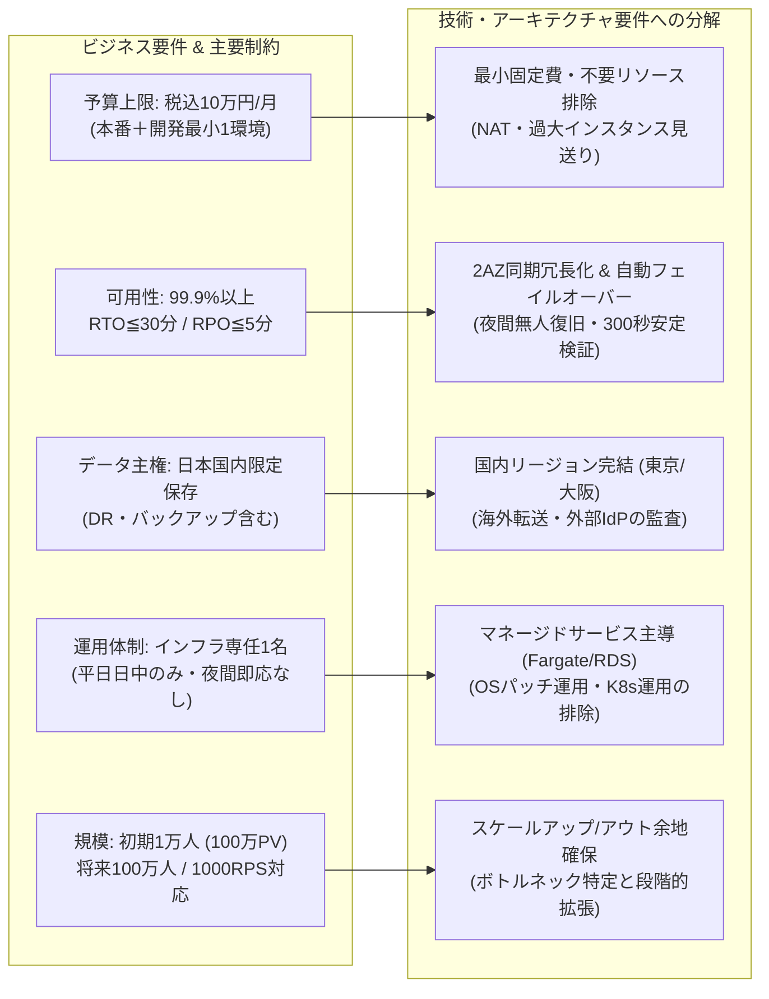

# クラウド検証LEVEL3 要件定義（取得範囲の整理）

出典：[ユーザー指定の共有チャット](https://chatgpt.com/s/cx_6a9fb8b9a1d081918765c68635003aa5)。確認日：2026-09-08（JST）。
取得証跡：[表示本文](sources/shared-chat.txt)。これは表示された本文の保存であり、非表示の文書・コードブロックを含む完全なエクスポートではない。
適用優先順位：この会話の最新のユーザー指示 → 既存の共通指示 → 共有チャットの要件。共有チャット内の例示を確定設計と扱わない。

## 原本で確認できた内容
- 目的：曖昧なビジネス要件・制約からAI自身が合理的なクラウド構成を判断できるか検証。
- A：指定された単一クラウドで設計。B：AWS・Azure・GCPを比較選定。C：実装・障害・変更への対応。
- 新規B2C、日本国内、初期ユーザー1万人・将来100万人、個人情報、24時間365日、可用性99.9%以上、RTO 30分、RPO 5分、開発5名・インフラ専任1名、初期月額10万円以内。
- 月間100万PV程度、アクセス10倍の例示。ユーザー数100倍からリクエスト数100倍と推定しない。
- 実行基盤、データストア、AZ・リージョン、CDN、WAF、IAM、DR、監視、IaC、CI/CD、運用等はAIの設計判断対象。特定サービス・台数の指定ではない。
- 評価観点：要件理解、Architecture妥当性、Security、Availability、Scalability、Cost、Operations、DR、Observability、Complexity、Vendor lock-in、Migration容易性、人間の修正量。5段階評価。
- 結果をすべてGitHubへ集約する依頼、分割実行と不要リソース削除の依頼を確認。
- モデルは実行画面でGPT-6 Astra Lightを選ぶ旨を確認。実行モデルの実測確認はできていない。

### 要件構造ツリー（ビジネス制約から技術要件への分解）

## 正式補足による統合

[正式補足要件](sources/supplement-2026-09-08.md)を不足部分の正式根拠として適用する。未取得原本は未取得のまま保持するが、追加の原本提示は進行条件ではなくなった。
- AはAWS指定。BはAWS/Azure/GCPを共通条件で再選定。
- 評価配点100点、5段階・合格基準、介入記録、GitHub集約・Issue管理は正式補足に従う。
- 初期シナリオ・共通指示は継続。A-1のみ実行し、重要回答未取得なら回答待ち。

## 旧文書との差分・矛盾の解消
|旧状態・記述|今回の優先内容|影響|
|---|---|---|
|原本本文・配点の取得が前提|正式補足で不足を補完|原本待ちの阻害を解除。取得成功とは記録しない|
|Aクラウド未指定|AのみAWS|BにAWS優先を持ち込まない|
|人間の修正量も評価観点の例示|指定11項目で100点、介入は別記録|介入を加点・減点の独自配点にしない|
|ローカルのみの準備履歴に未指定表記|保存先PUBLIC確定、補足受領済み|過去スナップショットは変更せず現在文書で更新|

明示的な数値要件の矛盾は確認していない。可用性・DR・予算・運用の両立は対象範囲が未確定で、成立を断定しない。

## 実行範囲・文書分担
実行共通指示は[execution-policy.md](execution-policy.md)、正式追加条件・評価は[補足](sources/supplement-2026-09-08.md)。A-1は統合コミットのGitHub反映確認後に開始済み。後続工程の設計・評価は先取りしない。

---

## 24要件一覧（REQ-01〜REQ-24 正本一覧表）

> [!NOTE]
> **【要件正本の位置づけ】**
> 本一覧は、正式業務回答および補足要件に基づき確定した**要件定義の正本**です。
> `experiments/A/A-1/requirements.md` は Phase A 初期時点での策定スナップショットであり、内容の一貫性を担保しています。

|要件ID|要件|状態|優先度|受入条件|回答元|
|---|---|---|---|---|---|
|**REQ-01**|AのみAWS。Bは3社同条件再選定|確定|P0|Aの製品制約をBに流用しない文書レビュー|Q07|
|**REQ-02**|登録/ログイン/プロフィール/一覧詳細/お気に入り、管理者更新|確定|P0|対象操作E2Eと権限制御。更新本人の次回参照にプロフィール/お気に入りが反映|Q01|
|**REQ-03**|画像・通知メールあり。決済/動画/チャット/重分析/利用者アップロードなし|確定＋設計詳細|P1|対象外を混入させない。メールは監視復旧対象、配信完了は主要API性能から除外。再試行・重複・画像上限はA-2で明示|Q01|
|**REQ-04**|初期登録1万人、3年程度で100万人|確定|P1|人数とMAU/DAU・要求倍率を区別。人数100倍からRPS100倍を算出しない|Q02,Q08|
|**REQ-05**|100万PV/月、動的通常10RPS/ピーク100RPS×15分、同時利用500人、読書き9:1|確定＋設計詳細|P0|静的要求を分離した負荷モデルで試験。PVとの関係、通常負荷継続時間・ピーク頻度を仮定として明記|Q02|
|**REQ-06**|主要API p95≦500ms、サーバー側エラー率<1%、通常/ピーク両方|確定＋測定詳細|P0|対象API別に外部入口からの応答計測を計画。100RPSを15分、500人モデルを区別。メール配信完了除外。計測詳細はA-2で明示|Q02|
|**REQ-07**|氏名/メール/認証/プロフィール/お気に入り、20GB＋2GB/月。画像100GB＋10GB/月・転送200GB/月|確定|P0|合成データで容量条件を表現。退会30日以内稼働系削除、バックアップ上限35日、復元時再削除を検証。禁止データを扱わない|Q03|
|**REQ-08**|本番データ・バックアップ国内保存、外部保存/転送先確認|確定|P0|認証・メール等外部依存を含むデータ所在地・転送経路の証跡。技術検証で法令適合完了と宣言しない|Q03|
|**REQ-09**|主要機能暦月99.9%以上、計画停止・依存基盤障害含む|確定＋測定詳細|P0|ログイン・一覧詳細・プロフィール/お気に入り参照更新を入口から外部測定。利用者端末回線のみ除外。管理/メール遅延は別監視。短期試験は月間実証としない|Q04|
|**REQ-10**|プロセス/実行基盤/DB/単一AZでRTO≦30分|確定|P0|影響発生から復旧後5分安定確認終了まで≦1800秒。検知含む。時刻証跡と未試験障害範囲を記録|Q05|
|**REQ-11**|対象障害でRPO≦5分、確定済み業務データ|確定|P0|障害時刻－復旧した最新確定データ時刻≦300秒。データ間整合・欠損/重複も確認。対象障害はREQ-10|Q05|
|**REQ-12**|初期本番＋最小開発検証、税込100,000円/月以内|確定|P0|通信/DNS/監視/ログ/backup/security/認証/メール込み。人件費/ドメイン/人的サポート除外を別記。無料枠/クレジット/長期割引非依存、変動余裕・超過調整を明示|Q06|
|**REQ-13**|開発5名・専任1名、平日日中対応、夜間即応保証なし|確定|P0|夜間通知と自動復旧の範囲を明示し、人の即応に依存した30分適合を認めない。未達は体制/要件調整事項|Q07|
|**REQ-14**|Web/GitHubと基本クラウド/IaC経験、Kubernetes本番経験なし、既存契約/連携優先なし|確定|P1|運用負担と教育・引継ぎを比較理由へ反映。経験不足だけで製品採否を事前決定しない|Q07|
|**REQ-15**|将来ピーク10倍と3年100万人を分離、将来予算未確定|確定＋設計詳細|P1|10倍の基準は100RPS→1000RPS。継続時間は仮定を明示。増強指標/費用/変更移行条件を提示、初期上限を成長時へ流用しない|Q08|
|**REQ-16**|個人情報保護・暗号化・秘密情報・IAM・監査、ログにPII/認証情報原則なし|確定＋設計詳細|P0|権限境界・ログマスキング・監査を設計、実データを証跡に含めない。監査保持と管理権限詳細を明記|Q03,Q07|
|**REQ-17**|基盤/DB/AZ/リージョン/CDN/WAF/境界の採否比較|確定|P1|A-2で採否・根拠・代替・見直し条件を記録。今回は選定なし|—|
|**REQ-18**|監視/IaC/State/CI-CD/環境分離/rollback/移行性|確定＋設計詳細|P1|最小開発検証環境の数・稼働時間と運用責任を予算内候補で明示。設計詳細はA-2|Q06,Q07|
|**REQ-19**|100点・5段階・合格条件を適用|確定|P0|A-3/B-3等で初回案/レビュー後を採点し、人間欄は空欄維持。A-1完了を設計合格としない|—|
|**REQ-20**|公開GitHub・PR/Issue相互リンク・秘密情報除外|確定|P0|回答→要件→将来判断/検証を追跡し、差分・リンク・公開対象・remote一致を確認|—|
|**REQ-21**|今回はA-1のみ、A/B資源作成なし|確定|P0|今回サービス選定・クラウド操作・PRマージなし。次回A-2は明示指示待ち|—|
|**REQ-22**|C予算/期限はC-0、独立変更シナリオ・cleanup|確定＋C前決定|P0|C-0で上限/期限/許可、後続で同一基準・変更/削除/残存証跡を確認|Q06|
|**REQ-23**|誤削除/論理破損は開始判断から4時間以内の暫定目標|暫定（ユーザー指定）|P0|判断時刻と復旧終了を記録し≦4時間を評価。復元時点/正常更新救済/損失を説明。発見までの時間は別に明示|Q05|
|**REQ-24**|リージョン停止は30分/5分範囲外、方針/費用/限界は必須|確定|P1|リージョン停止方針・概算・限界をA-2で提示。未合意の別RTO/RPOを保証と記録しない|Q05|

---

## 関連成果物・スナップショット

- [A-1要件整理スナップショット](../experiments/A/A-1/requirements.md)
- [質疑応答台帳](../experiments/A/A-1/questions.md)
- [前提仮定・リスク一覧](../experiments/A/A-1/assumptions-risks.md)
- [要件追跡マトリクス](../experiments/A/A-1/traceability.md)
- [正式業務回答](sources/business-answers-2026-09-08.md)
- [課題管理Issue #2](https://github.com/moruku36/cloud-validation-level3-astra-light/issues/2)

