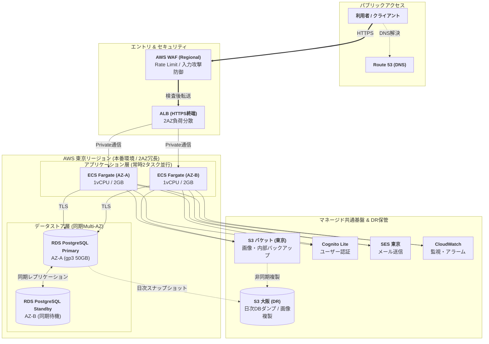

# A-2 構成図

  
   
  🔍 <b>画像をタップ/クリックすると別タブで原寸大・高解像度表示されます</b>

## 論理構成図 (Mermaid)

```mermaid
%%{init: {'themeVariables': { 'fontSize': '20px', 'fontFamily': 'ui-sans-serif, -apple-system, BlinkMacSystemFont, sans-serif' }}}%%
flowchart TB
  subgraph PublicLayer ["パブリックアクセス"]
    direction LR
    U["<font size=4><b>利用者 / クライアント</b></font>"]
    DNS["<font size=4><b>Route 53 (DNS)</b></font>"]
    U -. DNS解決 .-> DNS
  end

  subgraph IngressLayer ["エントリ & セキュリティ"]
    direction LR
    WAF["<font size=4><b>AWS WAF (Regional)</b></font><br/>Rate Limit / 入力攻撃防御"]
    ALB["<font size=4><b>ALB (HTTPS終端)</b></font><br/>2AZ負荷分散"]
    WAF ==>|検査後転送| ALB
  end

  subgraph TokyoVPC ["AWS 東京リージョン (本番環境 / 2AZ冗長)"]
    direction TB
    subgraph ComputeTier ["アプリケーション層 (常時2タスク並行)"]
      direction LR
      AppA["<font size=4><b>ECS Fargate (AZ-A)</b></font><br/>1vCPU / 2GB"]
      AppB["<font size=4><b>ECS Fargate (AZ-B)</b></font><br/>1vCPU / 2GB"]
    end

    subgraph DatabaseTier ["データストア層 (同期Multi-AZ)"]
      direction LR
      DB_Pri[("<font size=4><b>RDS PostgreSQL Primary</b></font><br/>AZ-A (gp3 50GB)")]
      DB_Stb[("<font size=4><b>RDS PostgreSQL Standby</b></font><br/>AZ-B (同期待機)")]
      DB_Pri <-->|同期レプリケーション| DB_Stb
    end
  end

  subgraph ServicesTier ["マネージド共通基盤 & DR保管"]
    direction LR
    S3["<font size=4><b>S3 バケット (東京)</b></font><br/>画像・内部バックアップ"]
    Cognito["<font size=4><b>Cognito Lite</b></font><br/>ユーザー認証"]
    SES["<font size=4><b>SES 東京</b></font><br/>メール送信"]
    CW["<font size=4><b>CloudWatch</b></font><br/>監視・アラーム"]
    DR_S3[("<font size=4><b>S3 大阪 (DR)</b></font><br/>日次DBダンプ / 画像複製")]
  end

  U ==>|HTTPS| WAF
  ALB -->|Private通信| AppA
  ALB -->|Private通信| AppB
  AppA -->|TLS| DB_Pri
  AppB -->|TLS| DB_Pri
  AppA --> S3
  AppB --> S3
  AppA --> Cognito
  AppB --> Cognito
  AppA --> SES
  AppB --> SES
  AppA --> CW
  AppB --> CW
  S3 -.->|非同期複製| DR_S3
  DB_Pri -.->|日次スナップショット| DR_S3
```

ALBからのみtask ingress許可。DB/S3は非公開。矢印は論理経路であり、AWS管理サービスの内部AZ構成を実測した図ではない。
