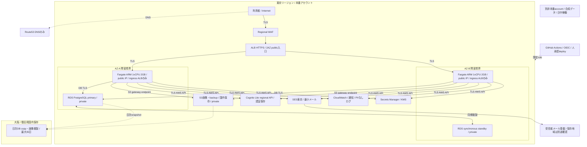

# A-2 構成図

```mermaid
flowchart TB
  U[利用者 / Internet]
  DNS[Route53 DNSのみ]
  U -. DNS .-> DNS
  subgraph TOKYO[東京リージョン / 本番アカウント]
    W[Regional WAF]
    L[ALB HTTPS / 2AZ public入口]
    subgraph AZA[AZ-A 障害境界]
      A[Fargate ARM 1vCPU 2GB / public IP / ingress ALBのみ]
      P[RDS PostgreSQL primary / private]
    end
    subgraph AZB[AZ-B 障害境界]
      B[Fargate ARM 1vCPU 2GB / public IP / ingress ALBのみ]
      S[RDS synchronous standby / private]
    end
    IMG[S3画像・backup / 国内保存 / private]
    ID[Cognito Lite regional API / 認証保存]
    SES[SES東京 / 最小メール]
    MON[CloudWatch / 通知 / PIIなしログ]
    SEC[Secrets Manager / KMS]
    U -->|TLS| W --> L
    L -->|TLS| A
    L -->|TLS| B
    A -->|DB TLS| P
    B -->|DB TLS| P
    P <-->|同期複製| S
    A -->|S3 gateway endpoint| IMG
    B -->|S3 gateway endpoint| IMG
    A & B -->|TLS AWS API| ID & SES & MON & SEC
  end
  SES --> MAIL[受信者メール基盤 / 保存地域は別途確認]
  subgraph DR[大阪 / 復旧用国内保存]
    COPY[日次DB copy・画像複製 / 最大35日]
  end
  IMG -.-> COPY
  P -. 日次snapshot .-> COPY
  CI[GitHub Actions / OIDC / 人承認deploy] -->|限定role| TOKYO
  DEV[別非本番account / 合成データ / 日中稼働]
```

ALBからのみtask ingress許可。DB/S3は非公開。矢印は論理経路であり、AWS管理サービスの内部AZ構成を実測した図ではない。
