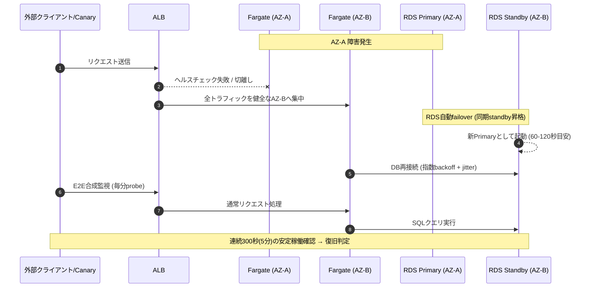

# 復旧・監視・運用・IaC方針

## 30分/5分の成立経路と限界（REQ-09〜11,13）
RDS同期Multi-AZは別AZの待機系へ自動切替。公式の60〜120秒は典型値で上限保証ではない。ECS unhealthy task置換＋ALBの切離し、常時2AZで人の応答なしに復旧する設計。DB再接続は指数backoff+jitter・期限付き、DNS cacheは短期、既存connectionを捨てて再確立、書込冪等化。backupからのrestoreをこの通常障害の経路には使わない。

|対象|自動経路|設計時間配分（未実測）|証跡・残リスク|
|---|---|---|---|
|プロセス/task停止|ALB切離し、残存task、ECS replacement|検知1分＋経路切替/置換4分＋安定5分＝10分目標|task kill、100RPS下のAPI/commit時刻。残存1task容量不足なら未達|
|基盤/単一AZ|他AZの既存taskで継続、ALB経路排除・RDS必要時failover|検知2分＋切替/再接続8分＋安定5分＝15分目標|AZ故障そのものの実測可否はC-0。task停止だけをAZ実測としない|
|DB主系故障|同期standbyへ自動failover、接続再確立|上と同じ15分目標、25分までに機能復旧し最後5分確認|RDS強制failoverは部分証拠。長transaction/共通障害で超過し得る|
|認証/地域managed service異常|AWS内部冗長化、アプリ期限内retry。JWT継続利用は既存sessionのみ|ログイン不能の顧客側代替経路なし|Cognito内部AZ停止から30分以内という保証・実証なし。ログインREQ-10適合は未確定、既存JWTをログイン成功と数えない|

同期commit済みの業務更新はRPO0を期待するが試験必須。毎秒の合成確定マーカーとプロフィール/お気に入りversionで、障害時刻との差≦300秒、欠損/重複/参照整合を確認。リクエスト成功応答とcommitは別々に保存。AZ障害と論理破損を混同しない。全対象障害30/5を保証したとは結論しない。

## Backup・削除・DR（REQ-07,23,24）
RDS PITRは東京35日、日次snapshot copy大阪（最大35日・copy成功監視）。S3画像はversioning＋大阪非同期複製、旧版を35日以内削除。snapshot/失敗jobの残存を台帳確認。画像はユーザーアップロードなしで、業務確定データはDB、画像参照はオブジェクト確認後commit。Cognitoのパスワードexport/復元は前提にできず、地域復旧では利用者の再設定が必要になり得る。
退会イベントを独立した国内の削除台帳へ保存し、30日以内に稼働DB・Cognito・outbox・派生値を削除。識別子は最小限、台帳はPIIとしてKMS保護・backup最長期間を過ぎた復元にも適用できる期間（削除後35日＋運用猶予7日を仮定）保持。台帳は業務backupを巻き戻す操作から独立させ、復元後は公開前に削除を再適用。台帳自体の保持は法令検討未了。
論理破損：判断時刻から4時間暫定。書込停止/隔離→直前PITRを別DBに復元→破損後の正常更新を監査ID/業務履歴で照合して選択救済→削除台帳適用→整合性確認→接続切替。業務履歴自体も破損し救済不能な更新は損失一覧を示す。全面自動restoreは誤判定で損失を拡大するため不採用、日中判断開始、発見までの時間は4時間に隠さない。所要時間は未測定。
地域停止：大阪はcold recovery（日次DB copy、画像複製、IaC/ECR資材の国内複製）。手動開始、DB業務損失はcopy成功時点以降最大約24時間＋copy遅延、コピー失敗時はさらに延長。目標復旧4〜12時間は計画仮定、保証なし。Cognito再設定・DNS伝播・容量確保で延長。平時copy費は概算に計上、復旧起動後は東京相当の追加基盤費が発生し、二重稼働なら月額最大概ね2倍。30分/5分地域DRは採用していない。

## 観測と対応
主要機能ごとの外部syntheticを東京/大阪から毎分、5分安定を5回連続成功で確認（計測誤差最大約1分を別記）。各機能の停止intervalの和集合で暦月SLI、計画停止・認証依存を含む。probe欠測は成功扱いしない。API性能は別指標、通常60分＋ピーク15分、主要APIごとp95≦500ms/5xx<1%、timeout・throttleも失敗として報告。p95目標とavailability判定timeoutは別（probe timeout2秒を仮定）。500人think-timeモデルとRPS固定の2試験を分離。
CloudWatchは5xx/p95、task数/AZ、CPU/memory、DB接続/credit/storage/replicationイベント、outbox age、backup/削除job成功を監視。1%サンプリングtrace、secret/PII禁止。重大通知はSNSメール、通知文にPIIなし。月次費用50/80/100%通知は課金停止装置ではない。
平日日中：週次patch/依存更新、週次backup/削除確認、月次restore、四半期DR訓練を計画。夜間は自動修復範囲のみで成立を評価。論理障害など自動修復不能は重大通知、有人追加費/目標調整を意思決定事項にする。

## IaC・CI/CD・rollback（方針のみ）
Terraformでnetwork/DB/app/identity/observabilityをmodule分割、prod/dev/drのState分離。東京S3暗号化・versioning・lockfileによる排他、限定role、監査。State/planは公開GitHubへ保存せず、CIでは値をマスクし変更概要・検査結果だけ公開。provider/version固定。bootstrap依存を別手順で管理しDB削除保護。
GitHub Actions OIDCはrepo/branch/environmentのsubとaudを限定、静的AWS鍵なし。test/security scan→ARM build→digest固定ECR→非本番smoke→本番environment人承認→ECS rolling update。最小healthy100%・最大200%、deployment circuit breaker/rollbackとCloudWatch alarm。DB expand/contract migrationで旧task互換維持。単純rollback不可なschema変更は日中別手順・backup、不可逆変更を自動実行しない。
public repoのCIには合成データのみ。非本番は単一task＋単一AZ db.t4g.small、月176時間、終了時削除・翌回IaC再作成（常時残るDB storage/backup費は別計上）。これは将来の非本番運用案で、C実験cleanup期限・予算はC-0で別承認。workflow権限不足は実装前に解消が必要、今回権限変更・実コード生成なし。
