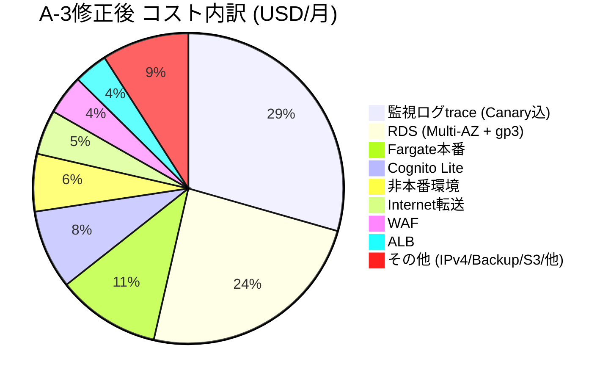

# クラウド検証LEVEL3-A 詳細結果レポート

作成日：2026-09-09（JST）。対象：A-1〜A-3、A-3完了[68e4607](https://github.com/moruku36/cloud-validation-level3-astra-light/commit/68e4607)。既存資料の集約のみで、新規設計・比較・採点・仕様価格調査・試験なし。

**A-1〜A-3の工程は完了。自己評価61→65点でA設計は合格基準未達、採用承認保留。クラウド構築・性能/障害試験は未実施。B-1開始も保留。** 根拠：[採点](A-3/scores.md)、[24要件判定](A-3/traceability.md)。

「事実」は記録で確認した事項、「当時の判断」は各工程の設計・仮定・採点、「今回の考察」はその読み取りを指す。考察を実測や再採点へ置き換えない。

## 1. 実験概要

|項目|確認できた内容|
|---|---|
|目的|曖昧要件から合理的なクラウド構成を判断し、不足発見・比較・実現性・説明・変更対応を評価|
|範囲|A-1要件整理、A-2 AWS設計、A-3設計レビュー。詳細IaC/アプリ実装・資源作成・負荷/障害試験なし|
|指定モデル|GPT-6 Astra Light|
|実行モデル識別・版|未取得。指定名を実測値と扱わない|
|推論設定・temperature・seed・context上限|記録不足で不明|
|並列性|サブエージェント不使用、段階ごと単独実施|
|実施日|A-1：2026-09-08、A-2/A-3：2026-09-09。文書とGitの記録による|
|使用ツール|Codex経由shell、Git、GitHub CLI/接続検索、Web検索閲覧、Browser共有本文取得、curl、Pythonによる価格抽出・文書/算術検査、Mermaid図ソース|
|今回|Git/ghによるPR・Issue・履歴確認、既存ファイル読取・集計のみ。新規の仕様価格調査なし|

出典：[共通指示](../../docs/execution-policy.md)、[補足要件](../../docs/sources/supplement-2026-09-08.md)、[A-2操作](../../evaluation/A-2-run.md)、[A-3操作](../../evaluation/A-3-run.md)。モデル設定の未確認を含め、特定モデルで確実に実行されたと断定しない。

## 2. 入力要件と人間による補足

最初の入力は国内B2C、初期1万人/将来100万人、100万PV/月、個人情報、24/365、99.9%以上、RTO30分/RPO5分、開発5名/専任1名、月10万円以内だった。機能・ピーク・保持・障害範囲・費目・夜間対応が不明で、製品/台数は指定されなかった。[当初依頼](../../evaluation/A-1-intake.md)

保存先/公開範囲・原本が未指定の間は依存作業を保留。人間が公開GitHubと共有チャットを指定したが、共有ページで配点等の全内容は取得できず、後から正式補足を受領した。原本を完全取得したとは記録していない。[準備記録](../../evaluation/repository-preparation.md)、[取得本文](../../docs/sources/shared-chat.txt)、[正式補足](../../docs/sources/supplement-2026-09-08.md)

|質問|確認事項|正式な実験回答|
|---|---|---|
|Q01|機能・処理/配信|会員/ログイン/プロフィール/一覧詳細/お気に入り/管理更新、画像・メール。決済等除外、本人の次回参照へ更新反映|
|Q02|負荷・性能|通常10/ピーク100動的RPS×15分、500人、9:1、p95≤500ms・server error<1%、static別|
|Q03|データ・保存削除|業務20GB＋2GB/月、画像100GB＋10GB/月、外向き200GB/月。国内保存、退会30日削除・backup35日・復元再削除|
|Q04|可用性|主要機能暦月99.9%、計画停止/依存障害含む、入口から外部E2E。管理/メール遅延は別監視|
|Q05|復旧|プロセス/基盤/DB/単一AZで影響開始〜5分安定終了まで30分、確定データとの差5分。論理破損4h暫定、地域停止別|
|Q06|費用範囲|本番＋最小非本番税込10万円、必須費込み、指定費除外、無料枠/長期割引非依存、C予算別|
|Q07|体制・経験|日中対応、夜間即応保証なし、基本Web/GitHub/クラウド/IaC経験、Kubernetes本番経験なし、既存優先なし|
|Q08|成長|3年程度で100万人、要求10倍とは独立。将来予算未確定、初期上限を流用しない|

[正式回答](../../docs/sources/business-answers-2026-09-08.md)は実在サービスの事実ではなく実験共通条件。[対応表](A-1/questions.md)、[24要件・受入条件](A-1/requirements.md)、[Issue #2](https://github.com/moruku36/cloud-validation-level3-astra-light/issues/2)へ追跡できる。

人間が指定したAWS限定はAだけで、Fargate/SQL/台数の誘導ではない。為替150、税換算10%、予備20%、730h、毎日1回ピーク、10RPS終日、API応答2KB、1万MAU、メール1万通、1task100RPS、台帳保持はAIの算定/設計条件。500人はTCP接続数と同義でなく、100万人をRPS100倍にしていない。[仮定](A-1/assumptions-risks.md)、[費用条件](A-2/cost.md)、[修正仕様](A-3/revised-design.md)

## 3. 工程別結果・完了条件・証跡

|工程|入力/作業|成果物・完了条件|結果/版|
|---|---|---|---|
|準備|保存先・部分原本・正式補足|出典/共通指示/handoffのGitHub保存|[PR #1](https://github.com/moruku36/cloud-validation-level3-astra-light/pull/1)、補足fb86c54|
|A-1初回|曖昧要件|22要件・8質問、回答待ちを明示|[6731042](https://github.com/moruku36/cloud-validation-level3-astra-light/commit/6731042)時点未完了|
|A-1回答反映|正式回答|24要件・受入条件、重大不足解消、remote保存・Issue閉鎖|[PR #3](https://github.com/moruku36/cloud-validation-level3-astra-light/pull/3)、完了[1745dfe](https://github.com/moruku36/cloud-validation-level3-astra-light/commit/1745dfe)|
|A-2|24要件/Issue #4|3案・採否・図・費用・出典・運用/DR/IaC方針、保存|初回[81cab82](https://github.com/moruku36/cloud-validation-level3-astra-light/commit/81cab82)、完了[b5f5022](https://github.com/moruku36/cloud-validation-level3-astra-light/commit/b5f5022)、[PR #5](https://github.com/moruku36/cloud-validation-level3-astra-light/pull/5)|
|A-3|A-2・基準・重点レビュー|24判定・F01〜07・修正・採点・未確認/引継ぎ、保存|[8870250](https://github.com/moruku36/cloud-validation-level3-astra-light/commit/8870250)、完了[68e4607](https://github.com/moruku36/cloud-validation-level3-astra-light/commit/68e4607)、[PR #6](https://github.com/moruku36/cloud-validation-level3-astra-light/pull/6)|

工程完了は成果物と保存の完了で、サービス稼働成功ではない。[A-1完了記録](../../evaluation/A-1-completion.md)、[A-2記録](../../evaluation/A-2-run.md)、[A-3記録](../../evaluation/A-3-run.md)

Git作者日時（JST）：A-1初回09/08 16:47:10・完了16:59:36、A-2初回09/09 09:06:11・完了09:10:14、A-3レビュー09:25:31・完了09:26:49。これらの差から実作業時間を推測しない。会話には日を跨いだ再接続があり、コミット日時と通信完了日時も同一とは限らない。

今回確認時、PR #1/#3/#5/#6はOPEN・未マージ。依存は `main ← prep/requirements-intake (#1) ← a1/requirements (#3) ← a2/aws-design (#5) ← a3/aws-review (#6)`。レポートはa3/aws-reviewから分岐しmainだけを参照していない。

## 4. Architecture判断

以下は当時の判断の要約で、本レポートでは再選定していない。

|候補|理由|トレードオフ/未検証|
|---|---|---|
|ECS/Fargate ARM＋RDS PostgreSQL Multi-AZ|条件付き採用。OS保守削減、SQL整合性、常時2AZ/同期待機で人的復旧依存を低減|固定費、単一writer、CPU credit、1task性能・認証依存RTO、全費目未確定|
|EC2 Auto Scaling＋RDS|OS/AMI更新・起動補充運用が専任1名に追加されるため不採用|価格比較未完。成熟運用と有意な節約で逆転可能|
|Regional REST API Gateway＋Lambda＋DynamoDB|有力代替だがcold start/query/index/整合性/移行負担を理由に初回不採用|同条件確定見積がなく、費用優位の結論は未確定|

[比較・設計](A-2/design.md)、[要件ID付きADR](../../docs/decisions/ADR-A2-001.md)、[構成図](A-2/diagram.md)、[復旧/運用/IaC](A-2/recovery-operations.md)。東京2AZのALB/WAF・各AZ1vCPU/2GB Fargate、RDS t4g.medium/50GB gp3同期Multi-AZ。task public IPはALB SGのみingress、DB/S3はprivate。CloudFrontは国内cache保存保証を置けず初期不採用、Cognito/SES東京・大阪cold DR。Kubernetesは業務必然性と体制から不採用。

修正後も基盤/台数は不変。監視本数/費用、安定確認、配置検査、削除照合、台帳未承認、TLS限界、worker隔離を追加した。[F01〜07](A-3/review.md)、[修正仕様](A-3/revised-design.md)。最終状態は条件付き案の承認保留。

**今回の考察：** SQL/運用の選定理由は説明されたが、代替の確定価格・性能証拠は揃っていない。最適構成を実証したとは言えず、A-3 Architecture 3点という既存評価と整合する。

## 5. 費用見積もりの変化

既存費用表の表示行を照合した。単位USD/月、円換算はUSD×150×1.10、予備費は別途×1.20。無料枠・credit・長期割引を控除していない。本番＋最小非本番の想定であり検証実費ではない。

|費目|A-2終了時|A-3修正後|差額|分類|
|---|---:|---:|---:|---|
|Fargate ARM本番|71.96|71.96|+0.00|据え置き、追加の数量/価格確認なし|
|RDS Multi-AZ|147.46|147.46|+0.00|据え置き、追加の数量/価格確認なし|
|RDS gp3|13.80|13.80|+0.00|据え置き、追加の数量/価格確認なし|
|ALB|23.58|23.58|+0.00|据え置き、追加の数量/価格確認なし|
|public IPv4|14.60|14.60|+0.00|据え置き、追加の数量/価格確認なし|
|WAF|27.70|27.70|+0.00|据え置き、追加の数量/価格確認なし|
|Cognito Lite|55.00|55.00|+0.00|据え置き、追加の数量/価格確認なし|
|S3保存/要求|6.00|6.00|+0.00|据え置き、追加の数量/価格確認なし|
|SES|2.00|2.00|+0.00|据え置き、追加の数量/価格確認なし|
|Internet転送|31.00|31.00|+0.00|据え置き、追加の数量/価格確認なし|
|監視ログtrace|30.00|196.44|+166.44|実行料漏れ訂正・最小本数明確化|
|Security|10.00|10.00|+0.00|据え置き、追加の数量/価格確認なし|
|backup/大阪copy|16.00|16.00|+0.00|据え置き、追加の数量/価格確認なし|
|非本番|40.00|40.00|+0.00|据え置き、追加の数量/価格確認なし|
|AZ間通信|6.00|6.00|+0.00|据え置き、追加の数量/価格確認なし|
|ECR/CI|3.00|3.00|+0.00|据え置き、追加の数量/価格確認なし|
|DNS/他|3.00|3.00|+0.00|据え置き、追加の数量/価格確認なし|
|合計|501.10|667.54|+166.44|監視費増加のみ|

出典：[旧費用表](A-2/cost.md)、[修正費用表](A-3/budget.md)、[公式Canary単価抽出](A-3/canary-prices.json)。

- **見積漏れ：** 東京/大阪各1本×60回/h×730h×0.0019USD＝166.44USDのCanary料を追加。従来30USDをその他監視として残し196.44USDへ。その他30USDの細目は未精算で、十分性を保証しない。
- **数量明確化：** A-2の「機能ごと」を独立Canaryにすると本数が増える。A-3はmulti-step1本/地域の最小案。A-2に明確な本数がないため「何本削減した」と推測しない。
- **設計変更：** 監視step・制御の明確化で、基盤増台による差額ではない。他の修正の追加運用費は数量化されていない。
- **表記修正：** 最初の81cab82には手書き比較欄の9.9/11.9万円と計算表の不一致があり、[ad0fb7d](https://github.com/moruku36/cloud-validation-level3-astra-light/commit/ad0fb7d)で8.27/9.92万円へ訂正。Canary漏れとは別問題。「初回8.27/9.92万円」はA-2終了時報告値で、初版の全記述が一致していたわけではない。[訂正記録](../../evaluation/A-2-run.md)

|版|予備費|月額税込（丸め前→表示）|10万円との差|超過率|
|---|---|---:|---:|---:|
|A-2|なし|82,681.50→82,682円|17,318.50円余裕|なし|
|A-2|20%|99,217.80→99,218円|782.20円余裕|なし|
|A-3|なし|110,144.10→110,144円|10,144.10円超過|10.1441%|
|A-3|20%|132,172.92→132,173円|32,172.92円超過|32.17292%|

### 月額費用と予算上限の比較（税込）

| ケース | 金額 (円) | 予算 (10万円) に対する状況 |
|---|---:|---|
| **A-2（予備費なし）** | 82,682 円 | `[■■■■■■■■            ] 82.7%` (1.73万円余裕) |
| **A-2（予備費20%）** | 99,218 円 | `[■■■■■■■■■■          ] 99.2%` (782円余裕) |
| **予算上限** | **100,000 円** | `[■■■■■■■■■■          ] 100.0% 基準線` |
| **A-3（予備費なし）** | 110,144 円 | `[■■■■■■■■■■■         ] 110.1%` (**1.01万円超過**) |
| **A-3（予備費20%）** | 132,173 円 | `[■■■■■■■■■■■■■       ] 132.2%` (**3.22万円超過**) |

### A-3修正後 月額費用内訳（合計: 667.54 USD）

差額は予備なし27,462.60円、予備込み32,955.12円。整数表示同士の差27,462/32,955円との違いは丸めで、新費目ではない。A-2未丸め501.0954USDと表示行合計501.10USDの差0.0046USDも既存監査記載。今回は表示行合計基準で照合し、過去表は変更しない。

730hの課金仮定と30日のPVモデルは別。為替150円と税10%は計画仮定、請求書や市場実勢の確認値ではない。為替超過境界は旧見積で181.42円（予備なし）/151.18円（20%）、修正版136.19円/113.49円。API応答2→20KBなら既存仮定で約510GB・61.2USD増。[既存感度分析](A-3/budget.md)

小費目・backup実効量・Internet単価・非本番課金粒度・scale/CPU credit等は未精算。「据え置き」は精度確認済みの意味ではない。監視置換/頻度変更/task小型化/上限変更は当時の未採用案であり、今回採用しない。

## 6. 評価結果（転記・算術照合のみ）

|項目|配点|初回|修正後|加重点 初回→後|当時の短い根拠|
|---|---:|---:|---:|---:|---|
|要件理解|15|4|4|12→12|要件値・境界を把握 → 起点を緩和せず24要件判定|
|Architecture妥当性|15|3|3|9→9|候補根拠あるが代替費未確定 → 骨格維持、採用優位は未確定|
|Security・IAM|10|3|3|6→6|PII台帳・転送の未確認 → TLS/監査限界を是正、保持承認未了|
|Availability|10|3|3|6→6|依存30分・単AZ容量未証明 → 安定計測是正、依存根拠不足は残る|
|Scalability|5|3|3|3→3|負荷分離あり、実容量根拠不足 → 同じ。実測なし|
|Cost|10|2|3|4→6|監視費重大不足、枠積算が粗い → 公式監視単価・感度訂正、予算は未達|
|Operations|10|3|3|6→6|専任工数・削除運用未具体化 → 失敗照合を追加、体制の成立根拠不足|
|Backup・DR|10|3|3|6→6|削除期限/台帳と復旧の穴 → 削除案補強、4h/地域復旧未実証|
|Observability|5|2|4|2→4|費用不整合と5回=5分の誤り → 多step・実時間300秒・欠測/費用が明確|
|Complexity|5|4|4|4→4|小規模managed構成の理由明確 → 同じ。追加ジョブの負担は開示|
|Vendor lock-in・移行性|5|3|3|3→3|SQL/コンテナ可搬、認証移行弱い → 同じ。認証救済は未具体化|

配点100、Σ（配点×評価点÷5）＝61→65。Costの加重+2とObservabilityの加重+2だけが増分。[元の採点・根拠](A-3/scores.md)、[配点・5段階・合格基準](../../docs/sources/supplement-2026-09-08.md)。今回は再採点せず、集計誤りは確認されなかった。

|条件|初回|修正後|
|---|---|---|
|80点以上|61、不充足|65、不充足|
|全項目3以上|Cost/Observabilityが2、不充足|充足|
|要件理解/Architecture/Security/Availability/Cost/DRが4以上|要件理解以外不足|要件理解以外不足|
|未達/未確認開示・追跡|初回に監視漏れあり|開示・追跡可能と自己評価|
|人間採点・採用承認|未実施|未実施・保留|

A-3の工程完了、Aの合格条件未達、人間の採用承認保留を区別する。Costの改善は予算成立への加点ではなく不成立の根拠明確化、Observability4は設計具体化であり実測5ではない。人間採点欄は空欄を維持している。

## 7. 発見した問題と残課題

|問題|発見/明示工程・証拠|影響と対処|未解決理由|
|---|---|---|---|
|監視費漏れ|A-3 F01、公式単価166.44USD|監視196.44USDへ、予算未達|全費目精算と予算/削減の判断なし|
|5分安定確認|A-3 F02、毎分5回は4分になり得る|300秒・6観測、欠測/失敗reset|実装・実障害時の精度未検証|
|全依存復旧|A-2で限界明示、A-3依存表|認証/DNS/経路/DB再接続を分離、JWTをlogin復旧としない|内部上限・E2E実証なし|
|片AZ性能/配置|A-2仮定、A-3 F03|healthy task検査・自動再配置、容量試験条件|1task100RPS・起動/配置未実測|
|メール保存/転送|A-2未確認、A-3整理|東京SESと受信側を分離、国内全コピーなら未達|受信先・条件範囲未確認|
|退会/削除台帳|A-2案、A-3 F05|42日台帳を30日削除の承認例外にしない|保持必要性・再識別・復元実測未了|
|期限消去|A-3 F04、Lifecycle非同期|期限前job・version/copy/snapshot照合|35日内物理削除の保証/実証なし|
|TLS説明|A-3 F06、target証明書非検証|暗号化と相手認証を区別、SG/登録role境界|実装/権限検査なし、説明訂正のみ完了|
|worker競合|A-3 F07、同じtask使用|concurrency/timeout/retry制限|API同時性能試験なし|

出典：[F01〜07](A-3/review.md)、[修正依存/保存表](A-3/revised-design.md)、[旧Issue判断](A-2/issue4.md)、[Issue #4](https://github.com/moruku36/cloud-validation-level3-astra-light/issues/4)。IssueはOPEN、文書訂正/算術確認だけ解決し、予算・復旧・データ適合は未解決。

## 8. 人間の介入とAIの自律性

|分類|記録|扱い|
|---|---|---|
|要件回答|3回：保存先等、正式補足、正式業務回答|1メッセージ1回、8項目を8回にしない|
|特定設計ヒント/誘導|記録上0回|AWS限定は実験条件、製品選択の誘導とは別|
|レビュー観点追加|A-3重点レビュー依頼1回|人間が費用/復旧/個人情報を重点指定|
|人間の重大設計直接修正|記録上0件|F01〜07はAIによる指示後の修正|
|人間のコード/設定直接修正|記録上0件|実装段階未実施|
|作業/レビュー時間|未取得|commit差やtool待ちを作業時間へ換算しない|
|token使用量/実残量/モデル料金|未取得|推定を実測値にしない|
|今回の依頼|レポート作成|要件回答/設計誘導/再採点へ加算しない|

[介入台帳](../../evaluation/human-intervention.md)。回数は取得できた会話/台帳の数え上げで全会話の自動テレメトリではない。他会話の介入は未取得。

**事実：** AIはA-1で質問・仮定を整理し、A-2で採否理由や一部未確認を自ら文書化した。一方、A-2の監視漏れは自己検査で見逃した。人間がA-3の重点レビューを指示した後、AIが単価漏れ・安定確認・削除/TLS等を具体的に特定した。「観点提示なしに全問題を自律発見した」とは言えない。[A-2操作](../../evaluation/A-2-run.md)、[A-3操作](../../evaluation/A-3-run.md)

**今回の考察：** 要件整理と説明/証跡化が進んだ一方、粗い費用枠の見落としが予算結論を変えた。指示後の修正でも重要条件が残った。一事例・モデル識別未取得・人間補足ありという条件から、モデル全般の能力や成功率を一般化できない。

操作失敗も設計試験とは区別する。[準備記録](../../evaluation/repository-preparation.md)にはGit未初期化、制限下認証失敗、共有取得/export失敗、workflow scopeによるpush拒否・空ファイル除外がある。[A-2記録](../../evaluation/A-2-run.md)にはCAエラーからTLS検証有効curlへの切替、ID省略記法の検査誤集計/修正がある。A-1最終push前の自動承認タイムアウトと再試行成功は取得可能な本会話にあるが、独立した完全ログファイルは未保存。完全操作ログを主張しない。

## 9. リソース・実費・cleanup

記録上、Aでクラウド作成なし、実際のクラウド利用費0円、残存（本実験分）なし、削除対象/期限なし。AWS全体の棚卸し・請求書監査による証明ではなく操作範囲と台帳の記録。モデル利用費は未取得で0円とはしない。[台帳](../../resource-inventory.md)

性能・片AZ容量・failover/RPO・論理破損復元・35日消去・月次可用性は実環境未検証。[T01〜11](A-3/validation-handoff.md)は計画のみ。CはC-0で費用/許可/期限を確定してから。実個人情報・機密State/Planは取得/公開していない。

## 10. Bへの引継ぎ（Bの設計/調査なし）

維持するのは人間の業務条件・対象障害・国内保存/削除・日中体制・初期本番＋最小非本番の税込10万円。Aの予算増額/監視頻度変更案は未承認であり既成事実にしない。将来予算未確定と要求10倍/100万人分離も維持する。

監視頻度/本数/付随費、非本番/backup量、認証MAU/メール、通信/IPv4、為替と予備費を同条件で比較する必要がある。Multi-AZ/SLAをE2E目標達成へ読み替えない。退会台帳・メール受信側・物理削除期限・夜間自動復旧範囲は他社でも確認が必要。

AWS/Fargate/RDSを正解や必須構成として持ち込まない。最適性未実証であり、今回他社優位を述べない。**次工程：Aレポートの人間確認後、指示があればB-1。** B-1保留、マージ/採用も未承認。

## 証跡・記録不足

- 原本完全取得・逐語会話exportは未取得。補足・表示本文・操作要約を使用。
- 実モデル識別/設定、token、モデル費用、実作業時間は不明。
- AWS実測/請求書照合、法令適合、受信側契約、代替精密見積、図画像レンダリングは未実施/未確認。
- 過去評価の集計誤りは確認されず、採点/設計資料は今回変更していない。
- 相対リンクはこのレポートのブランチに継承した資料を指す。固定した全証跡は[A-3完了68e4607のツリー](https://github.com/moruku36/cloud-validation-level3-astra-light/tree/68e4607)。PR/Issue状態は今回確認時点。

レポート保存：[PR #7](https://github.com/moruku36/cloud-validation-level3-astra-light/pull/7)（比較先a3/aws-review、依存PR #6、未マージ）、[本文作成コミット1df77b7](https://github.com/moruku36/cloud-validation-level3-astra-light/commit/1df77b7)。
