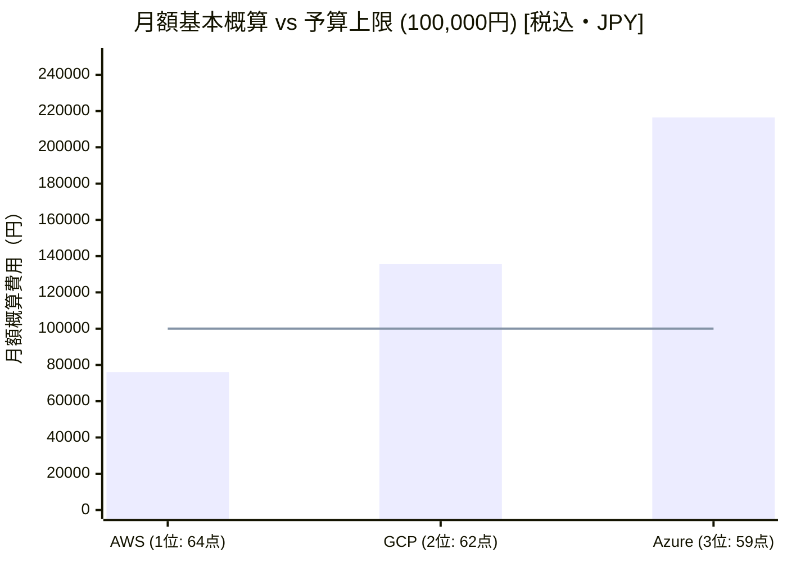
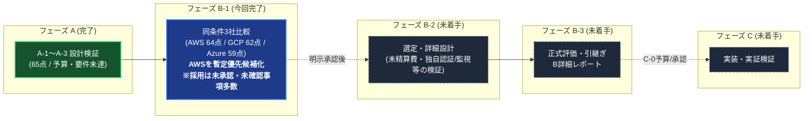

# B-1 開発者向け結果サマリー

B-1は比較・記録工程として完了。**AWSを次に検討する優先候補としたが、採用できると確認された案はまだない。**
対象は各クラウドの代表構成1案ずつであり、クラウド全体の優劣・最安構成の証明ではない。
B-2（選定・設計）、B-3（正式評価・引継ぎ）、C（実装・実証）は未実施。

## まず把握する比較結果

|項目|AWS|GCP|Azure|
|---|---|---|---|
|B-1暫定順位 / 相対点|1位 / 64|2位 / 62|3位 / 59|
|本番実行基盤|ECS Fargate ARM、1vCPU/2GiB×2|Cloud Run、1vCPU/2GiB、min2|Container Apps、1vCPU/2GiB×2|
|DB候補|RDS PostgreSQL t4g.medium、Multi-AZ|Cloud SQL Enterprise Plus N2、regional HA|PostgreSQL Flexible D2ds_v5、別AZ HA|
|入口|ALB＋WAF|regional external ALB＋Cloud Armor|Application Gateway WAF v2|
|本番 / DR保管|東京 / 大阪|東京 / 大阪|東日本 / 西日本|
|税込月額基本概算|76,034円|135,580円|216,493円|
|20%参考余裕込み|91,241円|162,696円|259,791円|
|基本額と10万円との差|23,966円の余地|35,580円超過|116,493円超過|
|原資料の予算適合判定|未確認：未知費用・容量増が残る|未確認：概算超過、東京主要単価未確定|未達：現代表案の固定費だけでも超過|
|最終採用|未承認|未承認|未承認|

金額は本番＋最小非本番1環境の計画値。為替150円/USD・税10%の比較仮定、無料枠・クレジット・長期割引は不使用。
すべてに未精算差額Uが残る。既存価格修正は増減、未計上必須費は増額となる。20%はUの上限保証でも必須業務要件でもない。
相対点はB-3の正式評価と異なる。人間採点は行っていない。GCPの「未確認」は予算内という意味ではない。

根拠：[比較・24要件・相対採点](comparison.md)、[費目別金額・感度](cost.md)、[計算JSON](cost-model.json)。

## 3案に共通するアプリの考え方

|処理|B-1で置いた方針|開発者が注意する点|
|---|---|---|
|認証|成熟したframeworkの認証機能とSQL sessionを使用|認証機能の運用をチームが引き受ける。MFA、鍵更新、脆弱性対応、認証CPU負荷は未実装・未検証|
|プロフィール・お気に入り|更新commit後に成功応答、本人の次の参照もwriter DBへ|キャッシュ、session失効、本人認可、同時更新、再試行の整合は試験が必要|
|画像|各社private object→アプリ→公開入口|CDNは代表案に含まない。画像処理・転送によるアプリ負荷は未測定|
|通知メール|SQL outbox→SES東京|3案すべてAWS依存。重複、再送、bounce、宛先/本文の保持・国外転送は未確認|
|外形監視|AWS東京/大阪のScheduler＋Lambdaで毎分multi-step probe|ログイン・主要参照更新を外から測る。独自probeの保守、欠測、監視自体の障害が残課題|
|バックアップ|native PITR＋国内別地域への日次dump|DB冗長化、過去時点復元、地域災害対策は別機構。退会済みデータの再削除を含める|
|非本番|1環境、176h/月、単一compute/DB、storage常設|停止/削除の課金粒度と再構築手順は未確認。本番SLOやAZ耐性をそのまま証明できない|

Azure/GCP案もメール・外形監視はAWSを使うため、単一事業者だけで完結しない。認証情報、IAM、請求、障害対応の管理が増える。
これはB-1が選んだ比較構成であり、外部サービスの選定が最適と確認されたわけではない。

## なぜこの費用差になったか

**AWS：A-3の約11.01万円から約7.60万円へ変わった理由**
Cognitoからframework認証へ、Syntheticsから独自probeへ変更し、通信・DRコピー等の使用量も再計算した。
同じ設計が安くなったわけではなく、認証・監視の実装保守責任も変わった。人件費は予算対象外でも運用負担は消えない。
独自監視の成立や認証性能、DB credit/増強が未確認で、Aの不合格が解消された証拠ではない。

**GCP：共通仮定のPITR30日がDB選択と費用に影響**
B-1の記録では30日PITRを満たす候補としてEnterprise Plusを選んだ。30日は業務必須ではなくAIの比較仮定。
原資料の7日PITRへ揃える限定感度では約99,686円＋Uとなるが、代表案への反映・採用はしていない。
さらに東京のDB/LB SKU価格は未照合。正式価格と復元可能期間を確定する前に恒常的な費用優劣を断定できない。

**Azure：現代表案ではDBとregional WAF/LBの固定費が大きい**
原資料ではDB compute356.24 USD＋WAF/LB591.30 USD＝税込約156,344円/月。
これはB-1で選んだSKU・容量仮定に基づく値で、全Azure構成の最低料金ではない。
入口やDB等を再設計する余地はあるが、その比較はB-2以降の判断事項。

根拠：[費用・感度分析](cost.md)、[価格の確認範囲](sources.md)、[A-3費用](../../A/A-3/budget.md)。

## 比較の前提と限界

- 基準と重みは候補採点前のコミット `4f486d2` で記録。初回案 `1812e6d` と修正 `b81b2bd` を保持。
- 正式負荷は通常10RPS・ピーク100RPS×15分。終日通常負荷/毎日ピークは算定仮定で、28.35百万API/月となる。100万PVと同一ではない。
- 初期外向き200GBを動的56.7GB＋静的143.3GBへ配分。Aの見積とは転送モデルが異なる。
- DB地域コピーは事前30GB/月から日次20GB全dump＝600GB/月へ3社共通で訂正。比較重みは変えていない。
- 2台/min2は縮退時100RPSの処理能力を示さない。GCP min2を2AZ各1台の容量予約とみなさない。
- 各社DBのメモリ・製品最小サイズ・価格の確認度は異なる。要求が同じでも実測性能が同じとは確認されていない。
- Vは原資料で公式確認/再利用とされた単価、Eは仮単価・適用未確認、Uは未精算差額。今回の要約作成では公式価格・仕様を再調査していない。
- 1000RPSと登録100万人は別シナリオ。将来予算/実MAUが未確定で、初期金額を将来へ外挿しない。

## 採用前に残る確認

|論点 / 要件ID|確認が必要なこと|実証・意思決定の境界|
|---|---|---|
|性能・夜間復旧 REQ-06/09/10/13|片AZ性能、認証/DNS/鍵/registry/DB再接続を含む復旧|RTOは検知を含み復旧後300秒安定終了まで30分。短期試験で月間99.9%を実証できない|
|データ所在地 REQ-08/16|メール受信先、認証、ログ、metadata、全backup/copy|国内region指定だけで全保存・転送先の適合完了にはならない|
|削除・保持 REQ-07/16/23|退会30日削除、35日backup上限、台帳保持と復元時再削除|日数設定だけで期限内消去を保証しない。法令判断は技術検証と別|
|費用 REQ-12|東京GCP SKU、通信、監視、backup量、非本番、容量増|AWSの余地も未精算費で消え得る。全案を同じ実使用量で精算する|
|成長 REQ-05/15|PV/API/MAU、DB変更量、1000RPS・100万人の整合|登録人数を負荷倍率として扱わない|
|復元 REQ-11/23/24|確定データRPO、正常更新救済、地域復元資材/鍵|論理破損4hは暫定。地域全停止は30分/5分の対象外|
|運用 REQ-13/14/18|framework認証・独自監視の維持工数、必要PITR期間|夜間有人即応や無断の予算/要件緩和を前提にしない|

追跡：[Issue #9](https://github.com/moruku36/cloud-validation-level3-astra-light/issues/9)。工程完了や文書マージを理由に解決扱いにしない。

## 保存状況・読む順序

PR #8をmainへマージ後、PR #10の比較先をmainへ変更してマージした。
B-1原成果物head：`7c06ed0432a86b6a3c23db4eb85872d0e4591192`。
PR #10 merge：`7ceaf2c3394d2c2bc74a152b3eaf1be1c1bb86fa`。
原比較・採点・費用は保持し、本要約を追加した。これはB-3で作成するB全体の最終レポートではない。

1. 本サマリー：結論と未確認事項
2. [comparison.md](comparison.md)：構成・24要件・順位の根拠
3. [cost.md](cost.md) / [sources.md](sources.md)：見積式と証拠の精度
4. [実行記録](../../../evaluation/B-1-run.md) / [統合確認記録](../../../evaluation/B-1-integration-review.md)：初回・修正・今回の確認
5. [handoff](../../../handoff.md)：次回の起点と承認範囲

次は明示指示後のB-2「選定・設計」。今回は開始していない。
クラウド操作・資源作成なし。既存台帳上は本実験残存なし/実費0円だが、アカウント全体・請求は未確認。

