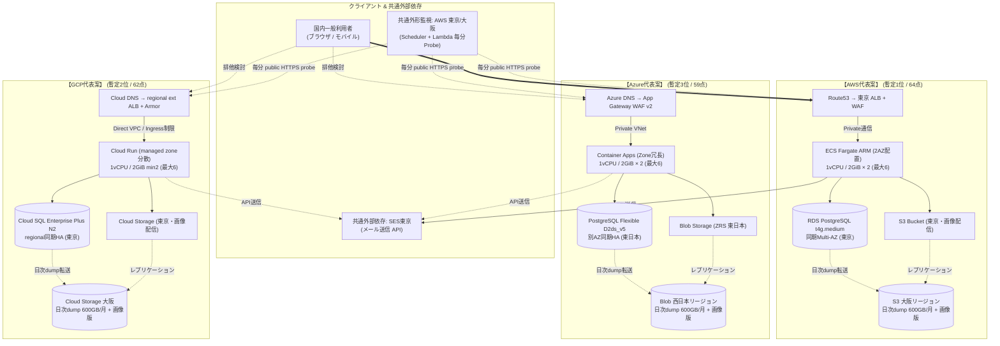
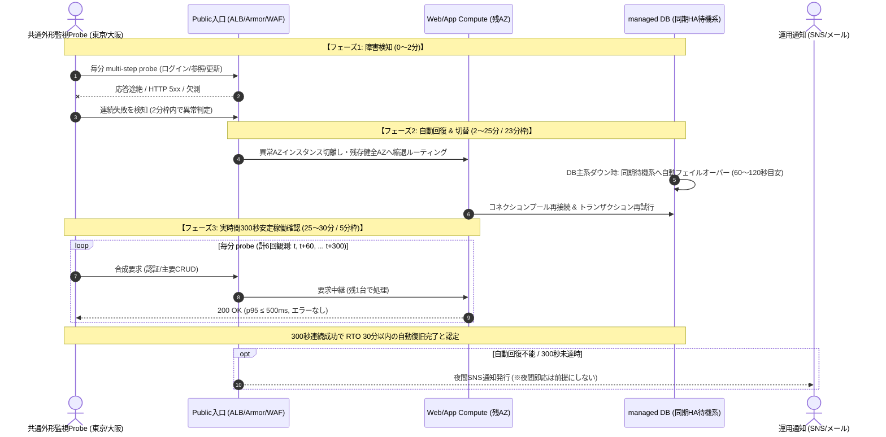
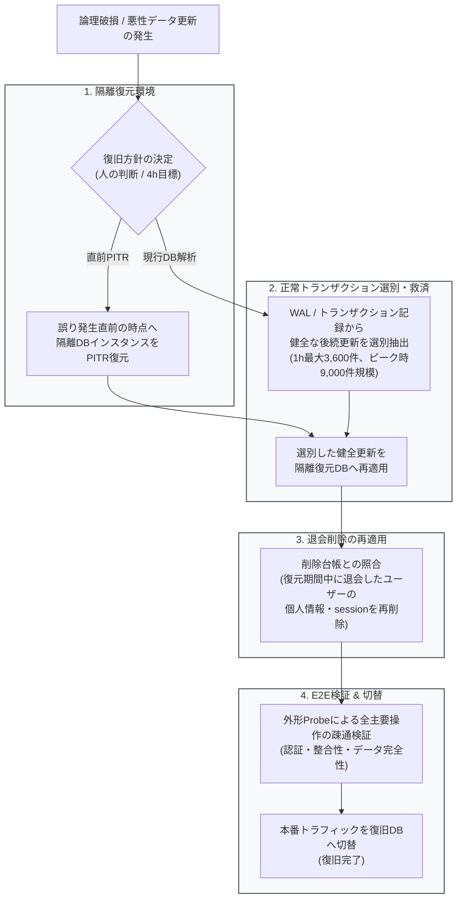
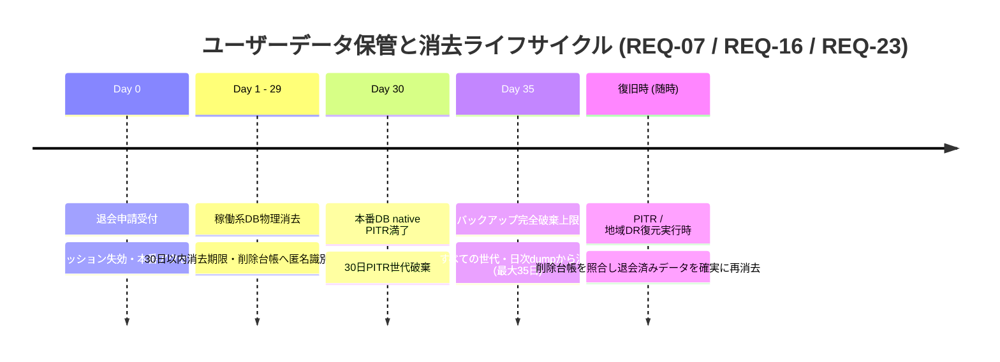
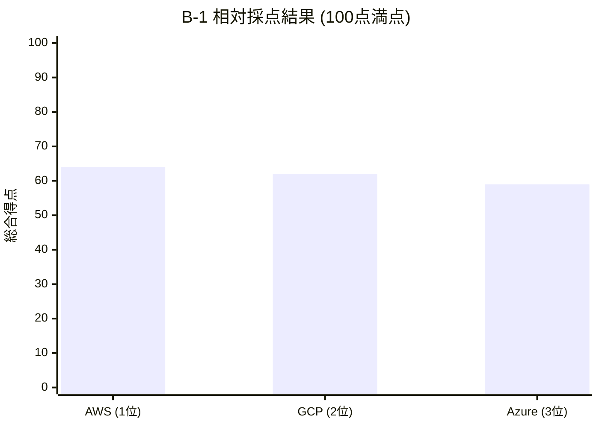

# B-1 AWS / Azure / GCP 同条件比較

2026-09-09。AWS/Azure/GCPの代表構成を各1案比較した。**採用可能と断定できる案はない**。AWSをB-2で先に検討する暫定候補とするが、設計合格・最終選定・人間の採用承認ではない。B-1相対順位はAWS64点、GCP62点、Azure59点。B-3の正式自己評価/人間採点は実施していない。

[採点前固定基準](comparison-criteria.md) / [概算と感度](cost.md) / [公式根拠と未確認](sources.md) / [操作・変更記録](../../../evaluation/B-1-run.md)。基準commit 4f486d2を先に記録、配点/尺度は変更していない。Aの不合格61→65とB-1開始は別判断である。

## 1. 共通の選択理由（Aの製品を必須にしない）

- 単一のWebアプリ＋managed PostgreSQLを各社で選ぶ。プロフィール/お気に入り/認証session/メールoutboxを同一transactionで管理し、writerを次回参照に使う。キャッシュによる本人更新の遅延を避ける。SQLは要件そのものではないが、一覧/管理更新の検索と移行性に適する。
- NoSQL強整合read/transactionでも成立し得る。ただし索引/アクセスpatternとデータ移行の検証が増えるため今回代表案にしない。SQL性能/費用が成立しないときのB-2再考条件であり、NoSQLが要件未達とは判断しない。
- OS/clusterを専任1名で管理しないmanaged containerを選ぶ。Kubernetesの高度な配置/可搬性は魅力だが、今回の機能と経験で追加管理負担を正当化できない。VMは定常単価が下がってもpatch/回復/監査の責任が増す。scale-to-zeroは性能/夜間復旧の未確認を増やすため本番は常時稼働。
- 認証はframework（Django auth等）の実績ある機能を使用し、password hash/sessionを各社国内SQLに置く案。独自暗号方式は作らない。Cognito/Entra External ID/Identity Platformを必須にせず、国外保存/転送の未確認を減らす代わりに認証の保守責任を引き受ける。managed IdP不採用でも所在地・漏えい対策が解決済みとはしない。
- CDNは初期200GBの規模では省略。画像はprivate object→アプリ→regional入口で配信しWAF迂回を避ける。リージョン内保存を優先し、global edge cacheの国内保証を推測しない。帯域/latencyが支障なら国内保存を確認できるCDNを再比較。
- WAFは必須製品ではないが、公開B2Cの入力攻撃/rate制御を運用1名で維持するためmanaged WAFを含める。Azureの地域WAF費用が高いことはクラウド全体が不適切という証明ではない。低価格なglobal入口は保存/転送範囲の確認が必要。
- サービス間の正確な設定/IaC/SQL schema/最終サイズはB-2以降。以下は費用を具体化するためのSKU候補である。

## 2. 代表構成と信頼・障害境界

|役割|AWS案|Azure案|GCP案|
|---|---|---|---|
|国内本番/DR保管|東京 / 大阪|東日本 / 西日本|東京 / 大阪|
|DNS/公開入口|Route53→regional ALB＋WAF|Azure DNS→App Gateway WAF v2|Cloud DNS→regional external ALB＋Armor Standard|
|compute|ECS Fargate ARM 1vCPU/2GiB×2、別AZ配置、拡張候補最大6|ACA consumption 1vCPU/2GiB×2、zone redundant VNet/内部ingress、最大6候補|Run instance課金1vCPU/2GiB、min2/max6候補、managed zone分散|
|DB|RDS PostgreSQL t4g.medium 2vCPU/4GiB、Multi-AZ、gp3 50GB|PostgreSQL Flexible D2ds_v5 2vCPU/8GiB×主待機、別AZ、64GiB×2|Cloud SQL Plus N2 2vCPU/16GiB、regional HA、SSD50GiB|
|認証・整合性|3案ともframework auth/sessionをwriter DBへ格納。成功応答はcommit後。プロフィール/お気に入り次回readもwriter、本人認可を各APIで確認|同左|同左|
|画像|private S3 Tokyo→app streaming|private Blob東日本/ZRS→app|private regional GCS東京→app|
|メール|SQL outbox→SES東京。東京障害時の送信遅延を監視|同じSES東京を外部依存として採用|同じSES東京を外部依存として採用|
|外形監視|全案共通：AWS東京/大阪Scheduler＋Lambdaからpublic URLへログイン/主要操作の合成multi-step。専用synthetic userで実PIIなし|同左（AWSの権限/費用管理も必要）|同左（AWSの権限/費用管理も必要）|
|native logs/metrics|CloudWatch / sampled traces|Azure Monitor / App Insights|Cloud Logging / Monitoring / trace|
|backup|native PITR30日＋日次dump直近2世代を大阪|PITR30日＋日次dump2世代を西日本|PITR30日を共通仮定とするためPlus。backup31世代＋日次dump2世代大阪|
|非本番|単一task/単一RDS small、176h、disk常設|ACA1/単一B1MS、176h、disk常設|Run1/単一Cloud SQL Enterprise最小custom、176h、disk常設|
|主な長所|当日主要SKU根拠を再利用でき、概算に予算余地|managed HAと既存Web/SQL技術で運用可能|managed zone routingとrevision管理、container移植|
|主な負担|burstable DB credit、ECS配置/SG/IPと独自auth/monitor|region WAF固定費、別platformのIAM/監視/SES、ACA/networking|東京DB/LB価格未確認、PITR30日仮定でPlus費用増、zone配置不可視|

compute2台/最大6は十分な性能の証明ではない。Azureは公式一般推奨3replicasに対し2を候補にしており、zone分散設定と残1台100RPSを検証する必要がある。GCP min2も2AZ各1の容量予約ではない。DBのメモリ差は製品最小/選択tierの差であり、AWS4GiBがGCP16GiBと性能同等と主張しない。

図の3分岐は同時構築するmulti-cloud本番ではなく相互排他的な代表案。AWS共通mail/probeだけAzure/GCPから外部利用する。入口のみpublic、DB/objectはprivate権限、DRは別国内地域・別削除権限。AWStask publicIPの受信はALB SGからのみ。Azure ACA内部ingress、GCP ingress制限で直URL迂回を閉じる方針だが設定検証は未実施。TLS暗号化とバックエンド相手認証は別確認、ALBのtarget証明書検証を誤って保証しない。

## 3. 必須・比較要件の対応（24件）

記号は短縮表記：**根拠＝設計上適合の根拠あり、未達＝設計条件で未達、未確認＝重要な根拠/試験が未確認**。根拠でも実証済みではない。複合要件は重要未確認を優先。根拠欄の節と[sources](sources.md)が証跡。工程要件は今回の指示で解釈する。

|ID|AWS|Azure|GCP|根拠・残る確認|
|---|---|---|---|---|
|REQ-01|根拠|根拠|根拠|§1/2：各1案、AWS指定はAのみ|
|REQ-02|根拠|根拠|根拠|§1/2：全機能、writer commit/read、本人認可。E2Eとsession invalidation未実施|
|REQ-03|根拠|根拠|根拠|§2/5：画像/メールoutbox、対象外機能なし。重複/再送試験が必要|
|REQ-04|根拠|根拠|根拠|costの登録/MAU/PV区別、§7の100万人条件|
|REQ-05|根拠|根拠|根拠|cost共通モデル28.35M、ピーク頻度等は仮定。実負荷整合未確認を開示|
|REQ-06|未確認|未確認|未確認|§4：100RPS×15分と500人/p95/error、片AZとauth競合の実測なし|
|REQ-07|未確認|未確認|未確認|§5：容量/保存対象は具体化、35日内消去と台帳再削除未確認|
|REQ-08|未確認|未確認|未確認|§5：本番/backup国内候補、SES受信先/ログ/metadata等の証跡不足|
|REQ-09|未確認|未確認|未確認|§4：全主要操作の外形計画、暦月実績なし、全依存SLO未証明|
|REQ-10|未確認|未確認|未確認|§4、A-HA/Z-HA/G-HA：自動復旧は根拠あり、影響〜5分安定終了30分の全上限なし|
|REQ-11|根拠|根拠|根拠|同期HA DBにauth/業務/outboxをまとめ、確定commitを保護。切替後commit時刻/重複/欠損検証は未実施。PITRだけを5分根拠にしない|
|REQ-12|未確認|未達|未確認|cost：AWS76,034＋U、Azure確認済み固定費だけで超過、GCP仮計算135,580＋U（regional SKU未確認）|
|REQ-13|未確認|未確認|未確認|§4/6：平日日中、自動回復/通知あり。夜間auth/設定/全依存障害への上限なし|
|REQ-14|根拠|根拠|根拠|§1/6：Kubernetes不要、managed運用。ただし独自auth/monitor負担を開示|
|REQ-15|根拠|根拠|根拠|§7/cost：1000RPSと登録100万人を分離、将来予算不明|
|REQ-16|未確認|未確認|未確認|§5：最小権限/暗号化/PII抑制/認証運用を方針化、詳細role・所在地/保持の監査未了|
|REQ-17|根拠|根拠|根拠|§1/2：container/SQL/HA/regional入口、CDN不採用、DRcopyのみの理由|
|REQ-18|根拠|根拠|根拠|§6：最小非本番、OIDC/State/CI分離/rollback/可搬性方針。実装はB-2以降|
|REQ-19|根拠|根拠|根拠|§8：固定100点・5段階の相対比較のみ、B-3正式採点と人間欄を保留|
|REQ-20|根拠|根拠|根拠|[run記録](../../../evaluation/B-1-run.md)とhandoffのPR/Issue/remote検証。公開対象は合成要件と文書のみ|
|REQ-21|根拠|根拠|根拠|今回B-1のみの明示承認を適用。作成/変更/merge禁止を維持|
|REQ-22|根拠|根拠|根拠|C-0予算/期限/操作許可は未決、Cへ自動移行しない|
|REQ-23|未確認|未確認|未確認|§5：隔離復元と正常更新救済、4h/復元容量/汚染識別未実測|
|REQ-24|根拠|根拠|根拠|§5/cost：cold restore方針/費用/限界。地域停止は30分/5分対象外|

今回の実証済み事項は「公開文書・価格抽出・計算・GitHub状態」の確認に限る。性能、SLO、障害復旧、削除、国内全コピー適合を実証した項目はない。

## 4. 全依存・夜間自動復旧・片AZ容量

|依存/障害|設計上の回復|限界/判定に必要なもの|
|---|---|---|
|process/compute|health/readiness失敗を入口から外しmanaged restart/replacement、残存replicaへrouting|quota、起動image/registry、secret/key、残AZcapacityの上限なし。最大6は確保済み容量でない|
|DB単体/AZ|AWS同期standby、Azure zone redundant、GCP regional HAへ自動切替|AWS典型60〜120秒、GCP約60秒はE2E上限ではない。pool再接続、DNS TTL、未完transaction再送・冪等を含む|
|本人認証|session/password DBも同じHA。既存sessionだけでなく新規loginをprobe|password hash負荷/キー参照/時刻/失効、auth library脆弱性/誤設定を自動修復できない。メール停止中の新規メール確認は別制限|
|DNS/TLS/WAF/入口|providerの冗長基盤、証明書期限/外形errorを監視|provider全体障害、誤DNS/証明書/全replica同時不良で30分以内を保証できない。TTL変更だけで解決しない|
|object/images|AWS S3 regional、Azure ZRS、GCS regional、appのtimeout/streaming|SDK/IAM障害、過大画像でapp負荷増。画像依存が主要正常終了を阻害した時間はSLIから隠さない|
|メール|DB outboxをcommit、上限付き再試行/冪等送信キー、bounce/滞留検知|SES/受信先障害の配信完了をAPI p95から除くが管理対象には残す。夜間配信再開の上限なし|
|監視/通知|2国内地点からpublic DNS/TLS/login/一覧詳細/profile/fav read-writeを実行、欠測も障害、mail/admin別確認|共通AWS停止、同時欠測、監視資格情報不良。通知を受けた人が夜間即応する前提なし。独自multi-stepの正確性未検証|
|registry/CI/鍵/管理API|稼働中データ経路とdeploy/回復の依存を分離、既知正常revisionへのrollback方針|AZ replacement/再構築には再び依存。直近正常imageの国内DRcopy/復号鍵の利用可能性は未確認|

RTOの比較用時間枠：検知2分以内＋自動回復/再接続23分以内＋実時間300秒安定=30分。これは**予算配分であって実測/保証ではない**。5分安定は少なくとも時刻t,t+60,…,t+300の6観測、失敗/欠測でreset。観測間の障害を見逃すため、実リクエストSLI/health/時刻証跡との照合をCで行う。暦月99.9%の許容停止は30日月43.2分、31日月44.64分。複数回の30分復旧でSLOを超えるためRTO達成だけでSLO適合としない。

片AZ喪失後にAWS/ACA残1×1vCPU/2GiBで100RPSの15分を処理できるかは未確認。仮に1要求CPU10msなら100RPSだけで1core相当になり余裕なし。auth hash/画像/DB待ちを含むCPU時間が短い実装だけで成立し得る。GCPは実配置の詳細非公開なので同じ1instance制約試験は代理に過ぎず、実AZ障害と同一視しない。各案とも正常時/縮退時API別p95≤500ms・error<1%とpool/DBcredit/CPU/メモリを確認する必要がある。

## 5. 保存・退会削除・論理破損・地域DR

|対象|国内・保持候補|未確認/損失の扱い|
|---|---|---|
|業務/認証/session/outbox|各社本番国内writer DB、暗号化at rest、TLS、native backup国内。退会処理でsession失効、全owner関連を30日以内削除|hashも認証情報、outboxの宛先も個人情報。復元時一緒に再削除する必要。SQL/IAMの安全性未試験|
|画像/version/backup|国内主地域と別国内地域。画像は管理者提供、ユーザーuploadなし。version/copy30日設定候補、DBbackup30日（GCP31世代）|手動snapshot/soft-delete/非current versionを含め35日上限。LifeCycleは期限通りの物理消去保証でない。期限前jobと全世代棚卸し/証跡が必要|
|削除台帳|識別子の最小化、国内暗号化、復元元とは独立して復旧後差分を適用、利用再開前に再削除|Aの42日保持例外は継承しない。hash/opaque IDも再識別可能なら削除対象。最長backup＋退会日を覆う台帳保持が30日稼働系削除と両立するか未解決。勝手な例外や匿名化完了の宣言をしない|
|メール|SES東京endpoint、本文/宛先最小化、link/token期限、送信結果のみ監視|受信側国内保存を指定できない宛先があり、外部転送/保存範囲が未確認。全受信copyを国内限定するなら現案では未達となり得る|
|log/trace/監査|国内workspace/bucket、30日、URL query/headers/body/SQL値/認証情報を記録しない。管理操作は必要な非PII証跡のみ|provider必須metadata、IP/user ID、global DNS/control plane、監視resultの保存所在地/保持を契約/設定で確認。法令審査済みでない|
|IaC/CI/資材/鍵|公開GitHubはコード/合成条件のみ、PII/State/Plan/secretを公開しない。機密State/鍵は将来各社国内別権限領域|CI log/registry/鍵のDR利用可能性と所在地未確認。本工程はIaC/Stateを作成しない|

論理破損：誤り直前へ隔離PITR→破損範囲を判定→健全な後続更新を現行DB/transaction記録から選別救済→削除台帳適用→全主要操作確認→切替。開始判断から4hは暫定目標、発見前経過と夜間判断待ちは別。後続正常更新と悪性更新を安全に分離できなければ自動再適用しない。全rollbackで復元点以降の正常更新を失い得る。業務1RPSの書込みなら1hで3,600更新、ピーク10RPSの15分で9,000更新が救済対象になり得る。DB変更履歴/個人情報保持との整合、復元時間、4h達成は未確認。

地域全停止：国内別地域に保存済み日次dump/画像/必要資材からcold restoreし、DB authも復元、退会差分再削除、TLS/秘密/入口確認後DNSを切替。main regionにある鍵/台帳だけを頼らない。平常copy費と24hの臨時起動費はcostに記載。成功した最終日次dumpまで戻るためRPO目安約24h＋copy失敗分、復旧時間は人の開始判断・容量確保次第で未確認。別地域常時standbyは初期代表案に含めず、30分/5分を保証しない。

## 6. 少人数運用・移行性

専任1名はapp担当と共有runbookで、日中の依存更新、auth library脆弱性/鍵rotation、DB upgrade、backup freshness/期限点検、restore演習、外形monitor false-positive、費用/容量を管理する。夜間は通知＋managed回復のみ。独自authとprobeの実装保守は人件費のため見積除外だが、責任は消えない。現体制で無人30分にできない障害を明確に残す。

非本番は1環境/176h、合成データ、prodとDB/IAM/secret/Stateを分離。CIはGitHub OIDCによる短命role、環境承認、image固定、app revision rollbackとDB互換migrationを計画。State/lock/backupは国内非公開、read-onlyとapply権限を分離する方針にとどめる。今回workflow/IaC実装や権限変更はしない。破壊的DB migrationはapp rollbackだけでは戻らない。

可搬性は共通OCI container/PostgreSQL dump/標準HTTPで比較的高い。auth/sessionもSQLなので外部IdP export制限を減らせる一方、hash方式/secret移行と強制再ログインを検証する必要。IAM/VNet/SG/WAF/monitor/secret/backupはprovider固有で再構築が必要。Azure/GCPは共通AWS probe/SESを含む2社運用で、障害窓口・secret・費用の複雑さを追加評価した。構成数の多いAzure regional WAF/VNetは学習負担が大きい。

## 7. 初期と将来の制約差

|シナリオ|AWS|Azure|GCP|
|---|---|---|---|
|初期100RPS/500人|残1task性能、RDScredit/4GiB、監視内製が鍵|残1replica、WAF CU、DB固定費が鍵|min2の配置/起動、SQL Plus費用、接続上限が鍵|
|1000RPS×15分/日|Fargate増/DBの非burstable化・pool・索引、LCU/WAF増|ACA増/DB scale、WAF CU/接続数、active課金増|Run増/SQL接続枯渇・pool・DB scale、LB/Armor増|
|約3年登録100万人|MAU課金なしだがauth/索引/backup増|同左。DB/WAFの固定部分は人数比例しない|同左。Plus→別tier判断は保存日数/性能と一緒に比較|

全案の増強入口はAPI p95/error、CPU飽和/credit、DB接続/lock/IO、outbox遅延、disk/backup増、費用余地。固定の閾値・詳細拡張構成はB-2以降。costに1000RPSの月API52.65Mと36ヶ月容量仮定を記録した。登録100万人からMAU/APIを100倍にしない。将来予算/MAU/検索の複雑さが未確定で最終費用不明。

## 8. B-1相対採点（正式自己評価ではない）

|項目|配点|AWS|Azure|GCP|差/根拠|
|---|---:|---:|---:|---:|---|
|要件理解|15|4|4|4|全24要件、正式200GB総量、仮定/成長を分離|
|Architecture|15|3|3|3|SQL/containerの理由あり、必要性能と独自auth詳細不足|
|Security/IAM|10|3|3|3|所在地/台帳/認証防御の重要未確認|
|Availability|10|3|3|3|HA根拠あり、全依存/残AZ/無人RTO未確認|
|Scalability|5|3|3|3|成長を分離、実容量/接続上限未実証|
|Cost|10|3|1|2|AWSは概算余地だがUあり。Azure固定費のみで大幅超過。GCPはPlus仮定で超過、SKU/代替で大幅修正が必要|
|Operations|10|3|3|3|managed化しても内製auth/probe保守と夜間限界あり|
|Backup/DR|10|3|3|3|HA/PITR/地域copyを分離、35日/台帳/4h未確認|
|Observability|5|3|3|3|同じ全主要step/2地点。内製probe/時系列と自己監視未検証|
|Complexity|5|3|2|3|AzureはWAF/VNet/ACAと外部AWS管理の組合せの見直しが必要|
|Vendor lock-in/移行性|5|4|4|4|OCI/SQL/HTTP、provider固有IAM等の再構築負担を明示|
|合計|100|64|59|62|Σ重み×点/5。人間評価は未記入|

初回相対採点はこの文書を最初にコミットした版。後の文書修正があればrun記録とコミット差分に残す。B-3の初回/レビュー後正式採点を代行しない。順位は1位AWS/2位GCP/3位Azureだが、**全案の重要必須未確認は解消していない**。

## 9. 暫定判断と人間へ引き継ぐ事項

暫定優先候補はAWS。今回の代表案では当日主要単価を確認でき、概算基本76,034円に23,966円の余地があるため、最初に成立性を詰める価値がある。独自認証/monitor、性能、削除/国内保存の課題が残るため予算適合・採用を承認しない。AのECS/RDSを正解として再利用した結論ではなく、外部IdP/CDN/監視方式と転送/copy仮定を再判断した結果である。

GCPは共通PITR30日のAI仮定を7日へ揃え直す価格感度で約99,686円＋Uまで変わる。30日PITRを業務必須にすり替えず、B-2で履歴救済の必要期間と費用を判断する。Azureは現代表案で予算未達。WAF以外の防御/DB tier・SQL以外も再検討余地があるが、今回4案目や詳細設計に進まない。

人間判断/確認事項は、(1)メール受信先まで含む国内保存範囲、(2)退会再削除に使う台帳保持の適法・要件整合、(3)独自auth/monitorを維持できる体制、(4)無人自動復旧で保証できない全依存範囲、(5)PITR必要期間と正常更新救済、(6)未精算価格/性能が予算を超えた場合の再設計か予算調整。要件を緩和した事実はなく、人間が決める前に調整案を採用しない。

次の1工程は**B-2：選定・設計**。今回B-1完了後は停止し、B-2は別途明示指示を受けて開始する。B-3では正式評価・引継ぎ・B詳細レポート保存、CはC-0予算/期限/操作許可が必要。PR merge/クラウド操作は実施しない。
