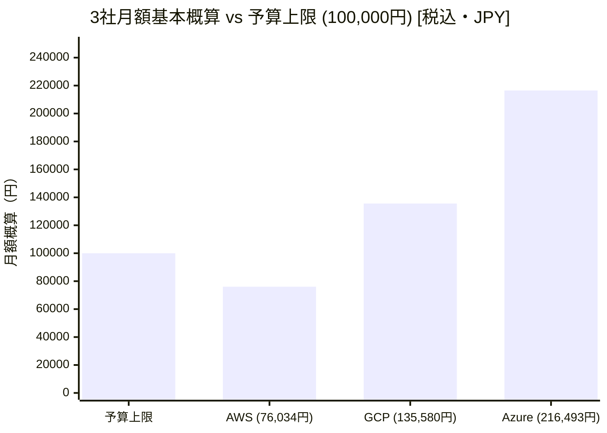
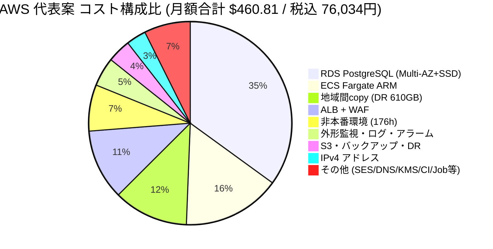
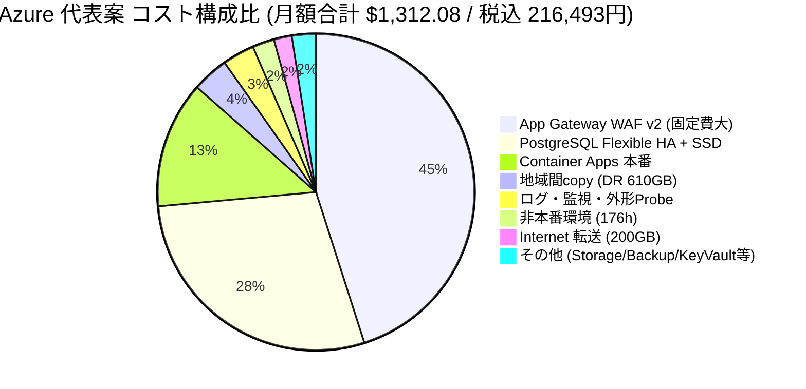
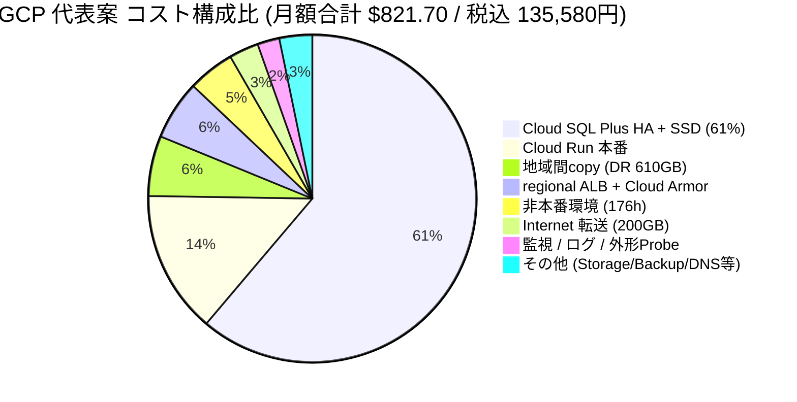
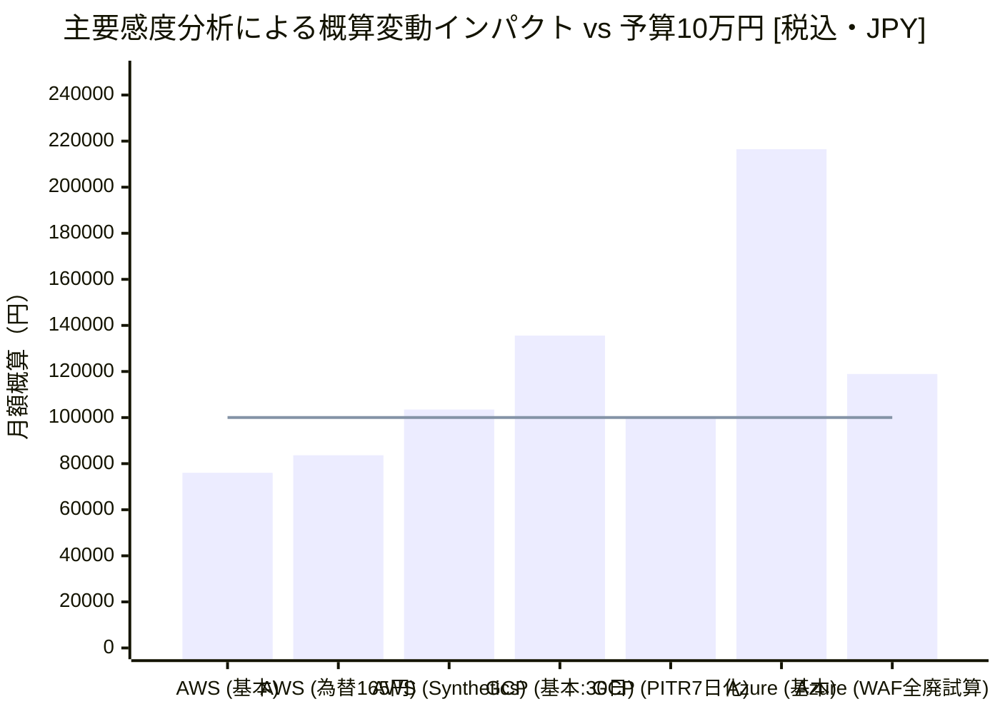

# B-1 共通使用量と概算費用

基準：[事前固定v1](comparison-criteria.md)（commit 4f486d2）。単価/確認日は[sources](sources.md)、機械可読の式と未丸め金額は[cost-model.json](cost-model.json)。2026-09-09、USD、無料枠/credit/長期割引を控除しない。為替150円/USD・税10%は比較仮定で市場実勢/請求書確認値ではない。

## 結論と金額の読み方

|代表案|税込基本概算|20%参考余裕込み|基本額10万円との差|REQ-12|
|---|---:|---:|---:|---|
|AWS|76,034円＋U|91,241円＋1.2U|23,966円の余地（Uを除く）|未確認|
|Azure|216,493円＋U|259,791円＋1.2U|116,493円超過|未達|
|GCP|135,580円＋U|162,696円＋1.2U|35,580円超過の仮計算|未確認（東京DB/LB単価未確定）|

Uは未精算差額（JPY）。既存行の価格/適用修正は正負あり、未計上の必須追加費用は増額。U=0と認定しない。表示額はVとEを足した**条件付き基本概算**であり確定見積/上限ではない。20%はUの上限や必須判定の代用ではない。Azureは確認済みDB compute356.24USD＋WAF/LB591.30USDだけで156,344円となり、他費目をゼロとしても超過する。GCPは仮単価超過を公式確定の未達と断言しない。いずれもクラウド実費ではない。

V=当日公式単価確認/既存当日抽出の再利用（数量/性能は仮定）。E=地域や適用単価/課金粒度に未確認がある仮計算。主要SKUでもEを明示。原価の精度以上の小数は計算再現用で、予算判断の精度を意味しない。

## 同じ負荷を3社へ適用

|量|共通値・関係・確認事項|
|---|---|
|登録/MAU/PV|登録1万人は要件、MAU1万人は仮定、PV100万/月は要件。MAU/PVからAPI数を算出しない|
|動的API|30日、10RPS終日＋毎日100RPS×900秒が通常を置換：10×2,592,000＋90×900×30=28,350,000/月。日次ピーク/通常終日は仮定|
|PVとの関係|28.35 API/PV。ページ複数API/背景通信なら成立し得るが実利用で未確認。PVを2835万へ書換えない|
|500人|人の同時利用。100RPSなら平均1操作/5秒という一例。100同時処理や500TCPと同義でない。平均処理100msならLittleの法則で10処理中、p95を平均に代入しない|
|read/write|業務API90/10%。monitor合成要求は別加算。SQL回数/索引/miss/認証hash処理は未測定|
|転送/静的|正式200GB総量=API28.35M×2KB=56.7GB＋画像/静的143.3GB。静的1M要求なら平均143.3KB。Aの257GB計算を継承しない。GB=10^9 bytes、GiB単価をGBへ同数適用したE行は約7.4%保守差を含む|
|外形|2国内地点×60/h×730h=87,600 runs、各10 HTTP要求=876,000追加要求。public入口課金合計30.226M/月（業務API＋静的＋monitor）。要求/応答計4KBとしてprobe外向き3.504GB別計上|
|メール|全案1万通×50KB=0.5GB、SES東京。宛先国/再送・bounce/suppression保持を要確認。メール本文data課金は200GBと別のprovider fee|
|ログ/監視|合計取込10GB/月、30日保持、custom10系列/10alarm、trace1%=283,500。アクセス本文/PII/credentials禁止。proxy/DB/monitorを含む予算量。大量フルtraceは採用しない|
|本番DB|live20GB、disk50GB以上、2GB/月増。Azureは選択disk粒度64GB、待機にも同量。auth/session/outbox/索引を20GBに含めた仮定で、追加実量はU|
|native backup|30日PITRの比較仮定。100GB月=20GB基底＋80GBの保持増分という課金量仮定。WAL/更新履歴は純増2GB/月とは別。GCPはPlus/backup31世代が必要。35日以内消去の証明ではない|
|国内地域DR|同じ日次論理dump20GB×30=600GB転送/月、宛先直近2世代40GB＋作業10GB=50GB月。前成功世代を確保してから入替。失敗で保持が延びる場合も35日上限を優先しfreshness不足を通知|
|画像/版|live100＋version20=120GB月、別国内地域copy120GB月、月間copy10GB。変更/上書き20GBの実量とretention再生成を要確認|
|job|日次dumpを合計5vCPU-h/2GiB月で仮計算、delete/棚卸し/台帳は追加0.50USDの暫定小費目。コピー600GB読出が業務性能を害さないか未確認|
|非本番|1環境、176h/月、compute1vCPU/2GiB、最小単一DB、disk32GB常設、画像5GB/backup10GB/API0.1M/転送2GB。顧客データなし。SLO/2AZ/WAF常設の対象外、機能・権限・復元は試験可能にする|

730h課金と30日負荷は月長の異なる計画近似で、確定した暦月実績ではない。31日月・監視生成API差分をU/感度へ含める。ログのprobe側AWSと各社側の分割、10seriesがAPI別SLIを満たすか、histogram/trace追加meterは未精算。

## 共通仮定の訂正記録（重みは変更しない）

事前基準のDB地域copy30GB/月は、日次20GB全量dumpと両立しない。増分copyを3社で実現済みと仮定せず、**3社とも600GB/月**へ訂正。DB宛先50GB月は30日全dumpの保存量ではなく直近2世代＋作業領域。主地域のnative PITR30日とは役割を分離する。画像10GBを足し地域転送610GB/月とした。初回基準はコミットで保持し変更しない。この訂正はusage過小計上の修正で、候補別の有利な数量操作ではない。

30日PITRは業務必須ではなくB-1のAI比較仮定である。GCPにPlusを要求する費用上の偏りを感度で明示。7日PITR等へ揃える共通仮定変更はB-2で比較し直せる。今回代表案/採点には混ぜない。

## 構成・課金の対応

- AWS：東京本番（Fargate2、RDS主待機、ALB/WAF）、大阪はcopyのみ。NAT不採用。task publicIPを持つがinboundはALBのSGのみ、DBはprivate。S3同地域→compute転送とInternetを二重加算しない。画像はappを介して配信し入口WAFを迂回させない。
- Azure：東日本ACA consumption2replicas/zone redundant VNet、PostgreSQL D2ds_v5別zone HA、App Gateway WAF v2 regional（min2相当20CU）。西日本copy。ACA内部ingressへ接続、独立NAT/Private Endpointは選択しない。基盤managed IP/環境network課金の含有をUで確認。Front Door Premiumはglobal保存未確認のため代表案不採用。
- GCP：東京Run instance課金min2、regional external ALB＋Armor、private Cloud SQL Plus N2 HA、GCS、copy大阪。Direct VPC egressはprivate ranges用、Internetはmanaged egress、独立NAT/VPC connector不採用。SQL publicIPv4なし。region外部LBとserverless NEG/Armorの組合せ・origin bypass防止は詳細検証待ち。
- 認証：3社とも成熟framework auth＋SQL session。MAUライセンス費なし（商用IdPを採用していないので0、無料枠依存ではない）。auth処理/保存はcompute/DB行に包含し、hash/MFA/rate limitの容量増はU。人件費除外でも運用負担は比較採点する。
- 外形監視：3案ともAWS東京/大阪のScheduler＋Lambdaで公開URLへ同じmulti-step probe。特定社の安い監視粒度へ合わせないため共通基盤にした。Azure/GCP案はAWSも契約/権限/支払/障害管理が必要。AWS案も別リージョン/別実行基盤だがprovider共通障害を検出できる保証はない。毎分は算定仮定、サービスSyntheticsを利用した証明はない。
- メール：3案とも東京SES API。GCP/Azureは外向きHTTPSの追加依存・認証secretが必要。API送信0.5GBは非AWSで追加transfer約0.06USD＋再送としてU（200GB利用者配信と区別）。独自SMTPサーバーは置かない。
- 基本TLS証明書/標準暗号化/基盤HA/managed identityは付帯を利用する候補。独立料金があるSKU/証明書保管や追加scanはU。20%で解決済みとしない。

## AWS 月額費目

|費目/SKU|USD|数量×単価・計算式|出典ID|状態|
|---|---:|---|---|---|
|Fargate ARM本番|71.9634|2task×730h×(1vCPU×0.04045＋2GiB×0.00442)|A-S02|V|
|RDS PostgreSQL t4g.medium Multi-AZ|147.4600|730h×0.202（待機込み）|A-S01|V|
|RDS gp3 Multi-AZ 50GB|13.8000|50GB×0.276（待機込み）|A-S01|V|
|ALB|23.5790|730h×(0.0243＋平均1LCU×0.008)|A-S03|V|
|本番IPv4|14.6000|ALB2＋task2=4IP×730h×0.005|A-S07|V|
|WAF|28.1356|1ACL×5＋5rules×1＋30.226百万要求×0.60|A-S06|V|
|画像/版/DR object|6.4640|東京120GB＋大阪120GB×0.025＋GET100万/1万×0.0037＋PUT2万/千×0.0047|A-S04|E|
|DB native backup|9.5000|100GB月×0.095、含有無料容量控除なし|S-BACKUP|E|
|DB DR dump storage|1.2500|大阪50GB月×0.025（20GB×直近2世代＋10GB作業領域、東京単価代用）|A-S04|E|
|地域間copy|54.9000|DB日次20GB×30＋画像増10GB=610GB×0.09|S-NET|E|
|本番Internet|24.0000|動的56.7＋静的143.3=200GB×0.12|S-NET|E|
|アプリDB AZ間|0.6000|30GB×0.02（両端合計の仮単価）。RDS同期複製は含めない|S-NET|E|
|logs/metrics/alarms/trace|13.4145|取込10GB×0.76＋保持10GB×0.033＋検索10GB×0.0067＋10metrics×0.30＋10alarm×0.10＋0.2835百万trace×5|S-OBS|E|
|Secrets/KMS|4.5500|3secrets×0.40＋1万読出0.05＋3keys×1＋10万KMS操作×0.03/1万|S-SEC|E|
|DNS|1.8000|本番/非本番2zones×0.50＋2百万query×0.40|S-DNS|E|
|Registry/scan/CI|1.1600|image2GB×0.10＋4scan×0.09＋100 CI分×0.006|S-CI|E|
|非本番compute/DB/disk|21.8910|task1×176h＋RDS small 176h×0.05＋32GB×0.138（disk常設）|A-S01/A-S02|V|
|非本番入口/IPv4/WAF|10.7958|ALB176h×0.0323＋3IP×176h×0.005＋ACL/rules176/730月＋0.1百万req×0.60|A-S03/A-S06/A-S07|E|
|非本番画像/backup/転送|1.3150|5GB×0.025＋10GBbackup×0.095＋2GB外向き×0.12|S-BACKUP/S-NET|E|
|dump/削除/監査job|0.7465|日次dump合計5task-h×0.04929＋1GB台帳/操作等0.50（保持適合未確認）|A-S02/S-BACKUP|E|
|外形監視実行（AWS東京/大阪）|7.4051|87600回×0.5GiB×10秒×0.0000166667＋0.0876百万回×0.20＋Scheduler 0.0876百万回×1|S-MON|E|
|監視転送（同上）|0.4205|87600回×10要求×4KB=3.504GB ×0.12|S-NET|E|
|通知メールSES東京|1.0600|10000通/1000×0.10＋0.5GB×0.12|S-MAIL|V|
|夜間通知SNS（東京）|0.0020|20 email通知/100000×2＋400 API/1百万×0.50＋丸め|S-MON|E|

## Azure 月額費目

|費目/SKU|USD|数量×単価・計算式|出典ID|状態|
|---|---:|---|---|---|
|Container Apps本番|169.7704|2replicas×730h×3600×(1vCPU×0.000024＋2GiB×0.000003)＋30.226百万req×0.40。全時間active上側仮定|Z-RATE|V|
|PostgreSQL Flexible D2ds_v5 HA|356.2400|2vCore×主待機2台×730h×0.122|Z-RATE|V|
|DB premium SSD|17.6640|主待機2×64GiB×0.138（50GB以上のdisk候補）|Z-RATE|V|
|Application Gateway WAF v2|591.3000|730h×(固定0.522＋最小2instances相当20CU×0.0144)。固定料金を2倍しない|Z-RATE/Z-WAF|V|
|public IP|3.6500|WAF入口1IP×730h×0.005。ACA基盤IP別確認|S-NET|E|
|画像ZRS/西日本copy|6.6200|東120GB×0.026＋西120GB×0.025＋100万GET/1万×0.004＋2万PUT/1万×0.05|Z-STORAGE|E|
|DB native backup|9.5000|100GB×0.095、無料容量控除なし|Z-RATE|V|
|DB西日本dump|1.2500|50GB×0.025|Z-STORAGE|E|
|地域間copy|48.8000|日次dump600＋画像10=610GB×0.08|S-NET|E|
|本番Internet|24.0000|200GB×0.12|S-NET|E|
|アプリDB AZ間|0.6000|30GB×両端合算0.02の暫定値。HA同期転送はサービス込み|S-NET|E|
|logs/metrics/alarms/trace|35.0000|10GB取込×3＋保持/検索1＋10metrics×0.30＋10alarm×0.10。traceは取込10GB内|S-OBS|E|
|Key Vault|1.0000|10万secret/key操作×0.10/1万。managed identityは付帯機能|S-SEC|E|
|DNS|1.8000|2zones×0.50＋2百万query×0.40|S-DNS|E|
|Registry/CI|5.6000|ACR Basic 1個×5/月＋100CI分×0.006|S-CI|E|
|非本番compute/DB/disk|28.0400|1replica176h全active＋0.1百万req×0.40＋B1MS176h×0.026＋32GB×0.138|Z-RATE|V|
|非本番object/backup/通信|1.3150|5GBobject＋10GBbackup＋2GB外向き。組込ACA ingress、独立WAFなし（合成データ/認証限定）|Z-STORAGE/S-NET|E|
|dump/削除job|1.0400|5vCPU-h/2GiB＋台帳/操作0.50|Z-RATE|E|
|外形監視実行（AWS東京/大阪）|7.4051|87600回×0.5GiB×10秒×0.0000166667＋0.0876百万回×0.20＋Scheduler 0.0876百万回×1|S-MON|E|
|監視転送（同上）|0.4205|87600回×10要求×4KB=3.504GB ×0.12|S-NET|E|
|通知メールSES東京|1.0600|10000通/1000×0.10＋0.5GB×0.12|S-MAIL|V|
|夜間通知SNS（東京）|0.0020|20 email通知/100000×2＋400 API/1百万×0.50＋丸め|S-MON|E|

## GCP 月額費目

|費目/SKU|USD|数量×単価・計算式|出典ID|状態|
|---|---:|---|---|---|
|Cloud Run本番 instance課金|115.6320|2instances×730h×3600×(1vCPU×0.000018＋2GiB×0.000002)。request別課金なし|G-RUN|V|
|Cloud SQL Enterprise Plus N2 HA|480.6320|db-perf-optimized-N-2:2vCPU/16GiB、HA込み(2×0.1396＋16×0.0237)×730h。東京SKU照合未完|G-SQL|E|
|Cloud SQL HA SSD|22.1000|50GiB×0.442（HA込み仮単価）|G-SQL|E|
|regional external ALB|20.0900|forwarding rule 730h×0.025＋入口/応答等230GiB×0.008。regional外部用SKU照合未完|G-LB|E|
|Cloud Armor Standard regional|28.1356|1policy×5＋5rules×1＋30.226百万req×0.60|G-ARMOR|V|
|public IP|3.6500|regional forwarding1IP×730h×0.005（適用/含有を未確認）|S-NET|E|
|画像GCS/大阪copy|6.0200|東京120＋大阪120GB×0.023＋GET100万/1万×0.004＋PUT2万/千×0.005|G-STORAGE|E|
|DB native backup|10.4000|100GB×0.104。PITR logs含有と課金を未精算|G-SQL|E|
|DB大阪dump|1.1500|50GB×0.023|G-STORAGE|E|
|地域間copy|48.8000|日次dump600＋画像10GB×0.08|S-NET|E|
|本番Internet|24.0000|200GB×0.12|S-NET|E|
|アプリDB AZ間|0.6000|30GB×両端合計0.02仮。HA内部同期を重複課金しない|S-NET|E|
|logs/metrics/alarms/trace|10.0000|10GB取込×0.50＋保持/検索1＋10metrics計3＋10alarm計1。traceはlog内。正式meter未精算|S-OBS|E|
|Secret Manager/KMS|0.8400|6active versions×0.06＋3key versions×0.06＋10万操作計0.30|S-SEC|E|
|DNS|1.2000|2zones×0.20＋2百万query×0.40|S-DNS|E|
|Registry/CI|0.8000|image2GB×0.10＋100CI分×0.006|S-CI|E|
|非本番compute/DB/disk|36.4684|Run1×176h＋SQL Enterprise single1vCPU/3.75GiB×176h＋32GB×0.221。SQL東京単価暫定|G-RUN/G-SQL|E|
|非本番object/backup/通信|1.3950|5GBobject＋10GBbackup＋2GB転送。run.app認証入口、独立ALB/WAFなし|G-STORAGE/S-NET|E|
|dump/削除job|0.8960|5vCPU-h/2GiB＋台帳/操作0.50|G-RUN|E|
|外形監視実行（AWS東京/大阪）|7.4051|87600回×0.5GiB×10秒×0.0000166667＋0.0876百万回×0.20＋Scheduler 0.0876百万回×1|S-MON|E|
|監視転送（同上）|0.4205|87600回×10要求×4KB=3.504GB ×0.12|S-NET|E|
|通知メールSES東京|1.0600|10000通/1000×0.10＋0.5GB×0.12|S-MAIL|V|
|夜間通知SNS（東京）|0.0020|20 email通知/100000×2＋400 API/1百万×0.50＋丸め|S-MON|E|

## 感度分析（1変数ずつ、税込。U別）

|同じ変化|AWS|Azure|GCP|判断への影響|
|---|---:|---:|---:|---|
|為替135 / 165円|68,431 / 83,637|194,843 / 238,142|122,022 / 149,138|150は固定比較仮定。実勢確認ではない|
|API応答2→20KB|86,138以上|226,597以上|146,357以上|510.3GB追加。AWS LCU/Azure CUの増加、GCP LB方向差は別U。200GB要件を増えた負荷で満たせるとはしない|
|native backup100→500GB|82,304|222,763|142,444|純増2GBからWAL/変更量を断定不可|
|AWSだけ容量不足でtask2→4|89,113|—|—|同じ負荷で必要容量が違うケース。仮定1task100RPSが不成立ならAWS優位幅縮小、DB増強/CPU credit別|
|全案PITRを7日へ揃える場合|76,034以下（実backup量次第）|216,493以下|99,686＋U|GCPをEnterprise2vCPU/8GiB HAへ変更した限定価格感度。30日自動backupは別維持可。日数は必須でないが同条件を変更するため今回代表案に反映しない|
|Azure active→全idleという下限試算|—|198,281|—|実負荷10RPSでは全idleにならない。idle単価採用でも現案は予算未達|
|Azure regional WAF全廃という算術だけ|—|118,928＋代替防御費|—|WAFは必須製品ではないが廃止だけでも現試算10万円に入らず。保護代替なしに削減を採用しない|
|AWS monitorへSynthetics料金を追加|103,497程度|+27,463|+27,463|87,600×0.0019/runのサービス料。Lambda等付随費は残る/再精算。AWSの予算結論を変える|

通常10RPSを1日8hへ限定（残16hを0と仮定）すると11.07M API/月、28.35Mとの差17.28M。3社ともAPI転送34.56GB、WAF約10.37USD/月が減り、Azure request約6.91USD減。固定DB/LB/常時computeを勝手に同率削減しない。AWSの概算減は約2,395円、GCPはLB処理差を加え約2,441円、AzureはrequestとInternetのみで約1,825円＋active低下分（未確認）。ピーク頻度は1回増/日で2.43M API＋4.86GB/月、AWS/GCP WAF約1.46USD・Azure request約0.97USDが増える。

GCP地域係数1.30は未確認：DB関連E単価が30%低ければ基本額は約2.6万円下がり、他の修正との組合せで順位/予算判定が変わる。確定単価取得前に「GCPは必ず高い」としない。AWSのUの増額余地は145.25USD（月23,966円）。独自監視の成立、auth性能、DB credit/増強、地域copy課金で使い切り得る。

## 成長・地域停止時費用

1000RPSが15分/日、通常10のままなら52.65M API/月、初期から24.30M増。静的PV/MAUは増えたと仮定しない。2KB応答ならAPI105.3GB、静的143.3GBを維持した場合転送248.6GB。1000RPS終日なら約25.92億API/月で別物。autoscaleの追加instance時間、DB/query/接続/メモリとWAF/CUを別見積する。単純に全原価10倍や6台で十分とはしない。
登録100万人は約3年。36ヶ月の純増モデルでは業務92GB/画像460GBになるが、100万人分の実row/索引/セッション量がこの増加と整合するか未確認。MAU・メール・PVが未確定なので将来総額不明。MAU1万人のままならauth MAU課金なしのままだが、登録データ/backupは増える。

地域DRの平常費は表内に包含：DBcopy storage＋610GB転送＋画像の宛先120GB＋dump実行分で、AWS約59.40USD、Azure約53.59USD、GCP約53.11USD/月（要求/台帳等は他行）。これは追加常時computeのないcold restore方針。1回24h復旧環境を並行稼働すると、同規模compute/DB/入口など概ねAWS9〜20USD、Azure37〜60USD、GCP24〜45USD＋restore通信/作業/Uを仮計算。24h想定の下限は各表の常設compute・DB・LB/WAF・IP行を24/730倍、上側は処理/一時diskの参考加算で、上限保証ではない。人の開始待ちと国内別地域容量不足により復旧所要時間は不明。日次copyのRPO目安最大約24h＋失敗分で、30分/5分は適用しない。

## 費目点検・未精算

|点検項目|処理と残り|
|---|---|
|LB/NAT/IPv4|選んだ入口に対応する行を計上、NATは選択しない。GCP IP内包/region LB meter、ACA managed networking課金は未精算|
|HA重複|AWS/GCPのHA単価は待機込み、Azureは主待機×2。同期複製課金をアプリAZ間に入れない|
|通信|200GB利用者総量、probe3.504GB、非本番2GB、地域copy610GBを区別。画像app経由でInternetを2倍にしない。DB dump初回/再送、copy先PUT/GET、物理単位差はU|
|監視|87,600 runの実行＋scheduler＋転送＋log/metric/trace/通知まで対象。Syntheticsを採用しないのにrun料を追加しない。probe logsの二拠点保管/集約/独立障害通知/10series内訳はU|
|認証/メール|内製認証はapp/DB/秘密の容量に含める。MAU課金は採用なし。SES通数/dataを計上、cross-cloudAPI・bounce・retention・再送は未精算|
|非本番|176hでcompute停止/削除できる前提。AWS/Azureの自動再起動・最小課金・再構築時間、停止中disk/backupを点検。初期データを残すstorageは常設課金。CI/secret/queryは共通行に含有|
|保持/copy|native100GB、DB DR50GB、画像版/地域計240GB、非本番backup10GBを別計上。native backup込み無料容量を控除しない。手動snapshot、soft delete、台帳、期限削除の追加作業費はU|
|security/CI|鍵/secret/registry/scan/CIを対象化。regional scan、署名/別地域image、監査exportの精算不足はU。国家/アカウント全体policyを確認済みとしない|

除外は人件費（認証・監視の内製/運用工数を含む）、ドメイン取得更新、有料人的supportのみ。CIを無料枠頼みにせず100分の仮単価を置く。人的対応の追加契約費は除外してもRTO達成根拠にできない。C検証予算は未確定。クラウド操作なし、モデル料金/トークン/実行時間は不明。
